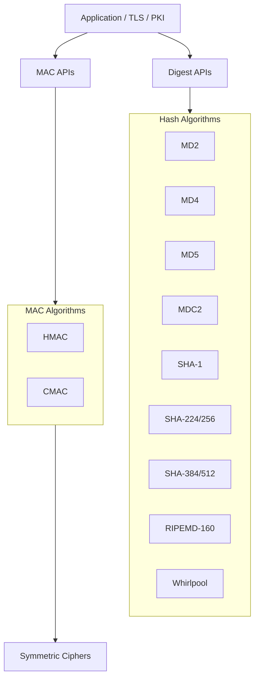
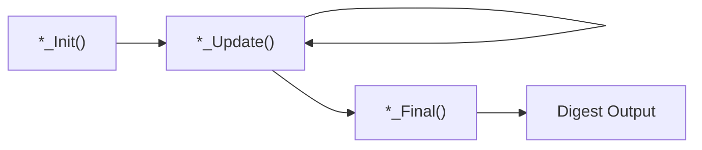
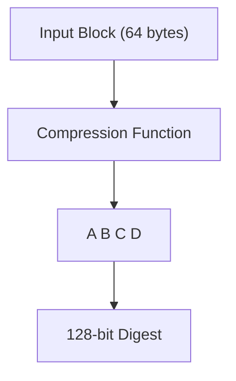
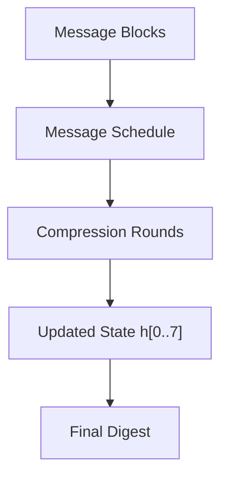
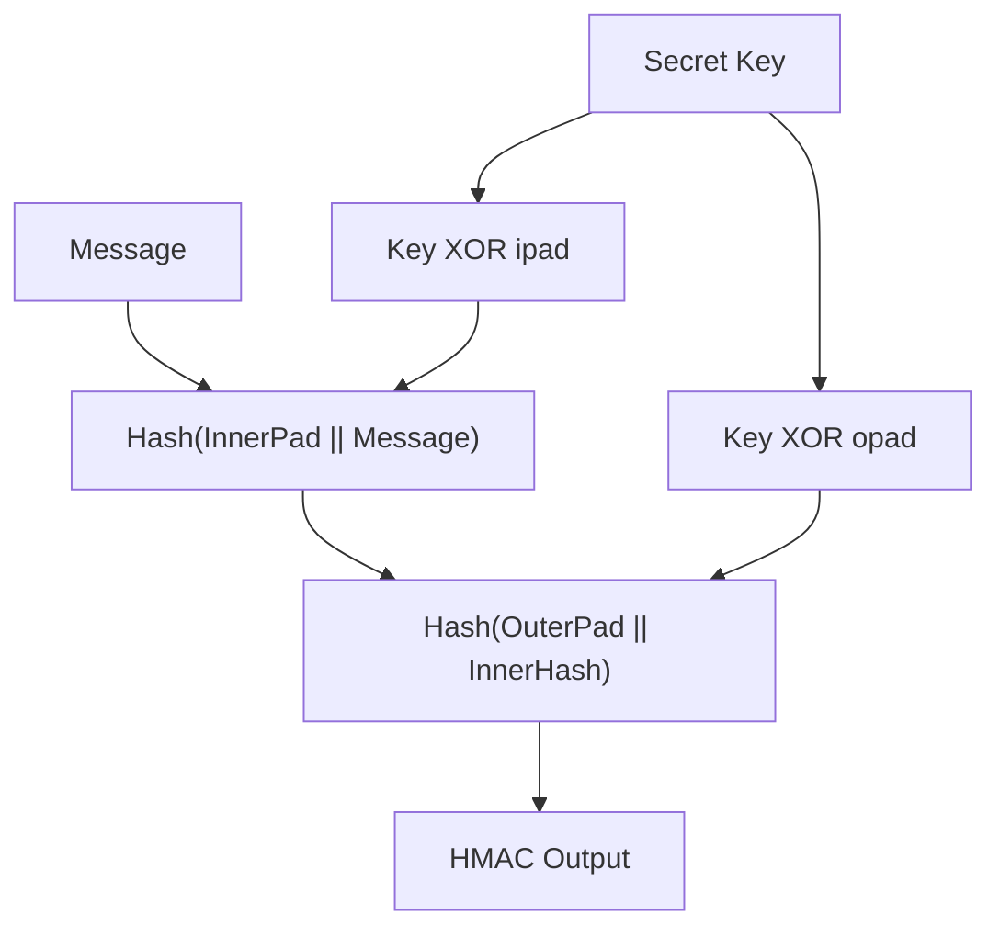
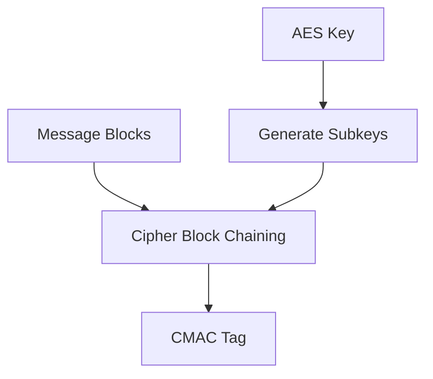
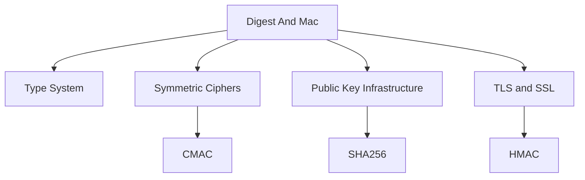
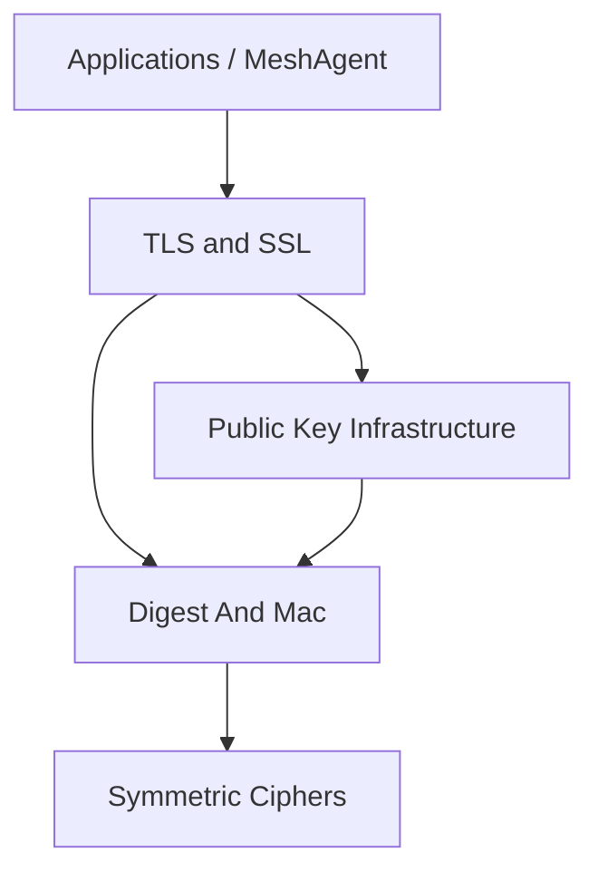

# Digest And Mac

The **Digest And Mac** module provides low-level cryptographic hash (message digest) algorithms and Message Authentication Code (MAC) primitives used throughout the OpenSSL integration in MeshAgent. It exposes legacy context-based APIs for computing fixed-length digests and keyed authentication codes.

This module underpins critical security features such as:

- Certificate and signature verification
- TLS handshake integrity
- Secure password hashing and token validation
- File and firmware integrity checks
- HMAC-based authentication schemes

It is part of the broader OpenSSL stack and works closely with:

- [Symmetric Ciphers](../Symmetric Ciphers/Symmetric Ciphers.md)
- [Public Key Infrastructure](../Public Key Infrastructure/Public Key Infrastructure.md)
- [TLS and SSL](../TLS and SSL/TLS and SSL.md)
- [Type System](../Type System/Type System.md)

---

## 1. Architectural Overview

The Digest And Mac module implements two categories of primitives:

1. **Unkeyed Hash Functions (Message Digests)**
2. **Keyed Message Authentication Codes (MACs)**

### High-Level Architecture

### Key Observations

- All digest algorithms follow a **context-based streaming API**.
- HMAC and CMAC provide **keyed integrity protection**.
- CMAC depends on block ciphers defined in the Symmetric Ciphers module.
- HMAC is typically built on SHA-2 or SHA-1.

---

## 2. Message Digest Algorithms

Each digest algorithm defines:

- A context structure (`*_CTX`)
- Internal state structure (`*_state_st`)
- Block size and digest length constants
- Streaming functions: `Init`, `Update`, `Final`

### Generic Digest Processing Flow

This pattern applies consistently across:

- `MD2_CTX`
- `MD4_CTX`
- `MD5_CTX`
- `MDC2_CTX`
- `SHA_CTX`
- `SHA256_CTX`
- `SHA512_CTX`
- `RIPEMD160_CTX`
- `WHIRLPOOL_CTX`

---

## 3. Algorithm Families and Context Structures

### 3.1 MD2

- Digest length: 16 bytes
- Block size: 16 bytes
- Context: `MD2_CTX`
- Internal fields:
  - `num`
  - `data[16]`
  - `cksm[16]`
  - `state[16]`

Primarily retained for legacy compatibility.

---

### 3.2 MD4 and MD5

- Digest length: 16 bytes
- 64-byte input block size
- State registers: A, B, C, D
- 32-bit word-based internal processing

Both are cryptographically broken and deprecated for secure usage.

---

### 3.3 MDC2

- Digest length: 16 bytes
- DES-based construction
- Context: `MDC2_CTX`
- Uses two DES chaining values (`h`, `hh`)

MDC2 integrates tightly with DES from the Symmetric Ciphers module.

---

### 3.4 SHA Family

#### SHA-1

- Digest length: 20 bytes
- Context: `SHA_CTX`
- State: 5 × 32-bit words

#### SHA-224 / SHA-256

- Context: `SHA256_CTX`
- 8 × 32-bit state words
- Variable output length (224 or 256 bits)

#### SHA-384 / SHA-512

- Context: `SHA512_CTX`
- 8 × 64-bit state words
- 64-bit optimized architecture

SHA-2 variants are the recommended secure default for hashing.

---

### 3.5 RIPEMD-160

- Digest length: 20 bytes
- Dual parallel compression structure
- Context: `RIPEMD160_CTX`

Commonly used in blockchain and legacy PKI systems.

---

### 3.6 Whirlpool

- Digest length: 512 bits
- Wide internal state (512-bit block)
- Context: `WHIRLPOOL_CTX`

Designed for high-security hashing applications.

---

## 4. Message Authentication Codes (MAC)

MACs provide **integrity + authenticity** using a secret key.

### 4.1 HMAC

- Context type: `HMAC_CTX`
- Built over any hash function (commonly SHA-256)
- Defined in `types.h` as opaque structure

HMAC construction:

HMAC is heavily used in:

- TLS record authentication
- API request signing
- Token validation

---

### 4.2 CMAC

- Context: `CMAC_CTX` (opaque)
- Built on block ciphers (e.g., AES)
- Depends on EVP cipher layer

CMAC relies on block ciphers defined in the [Symmetric Ciphers](../Symmetric Ciphers/Symmetric Ciphers.md) module.

---

## 5. Dependency Relationships

The Digest And Mac module integrates with multiple OpenSSL subsystems.

### Integration Points

- **PKI**: Uses SHA family for certificate fingerprints and signature hashing.
- **TLS**: Uses HMAC for record authentication and handshake verification.
- **Symmetric Ciphers**: Supplies cipher primitives for CMAC.
- **Type System**: Provides opaque structure definitions such as `HMAC_CTX`.

---

## 6. Security and Deprecation Notes

Many algorithms in this module are marked deprecated in OpenSSL 3.x:

- MD2
- MD4
- MD5
- MDC2
- SHA-1 (for most security-sensitive uses)

### Recommended Usage

| Use Case | Recommended Algorithm |
|-----------|----------------------|
| General hashing | SHA-256 |
| High security hashing | SHA-512 |
| Message authentication | HMAC-SHA256 |
| Block-cipher-based MAC | CMAC with AES |

Legacy algorithms are preserved for:

- Backward compatibility
- Legacy certificate chains
- Older protocol interoperability

---

## 7. Internal Context Design Pattern

All digest contexts share structural similarities:

- Running state registers
- Bit length tracking (`Nl`, `Nh` or `bitlen[]`)
- Partial block buffer (`data[]`)
- Block counter (`num`)

This enables:

- Incremental hashing of streaming data
- Reusable contexts
- Deterministic finalization

---

## 8. Role Within the OpenSSL Stack

The Digest And Mac module is a foundational cryptographic layer:

- It does not manage keys (handled in PKI and EVP layers).
- It does not manage cipher modes (handled in Symmetric Ciphers).
- It provides deterministic transformation from input data to fixed-size outputs.

In the full OpenSSL architecture:

The module ensures integrity, identity binding, and authentication across all higher-level cryptographic operations.

---

## 9. Summary

The **Digest And Mac** module:

- Implements core hash functions from MD2 to SHA-512 and Whirlpool
- Provides HMAC and CMAC authentication primitives
- Follows a consistent streaming context design
- Integrates tightly with TLS, PKI, and cipher modules
- Retains legacy APIs for compatibility while supporting secure modern algorithms

It forms one of the most security-critical layers of the OpenSSL integration and must be used with modern, non-deprecated algorithms in production systems.