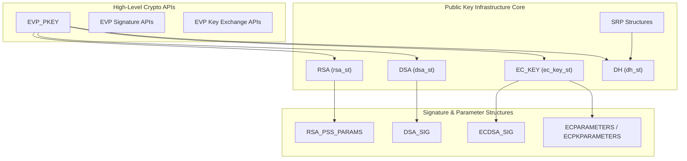
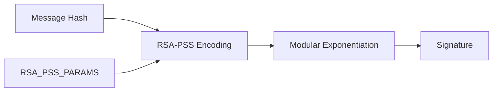
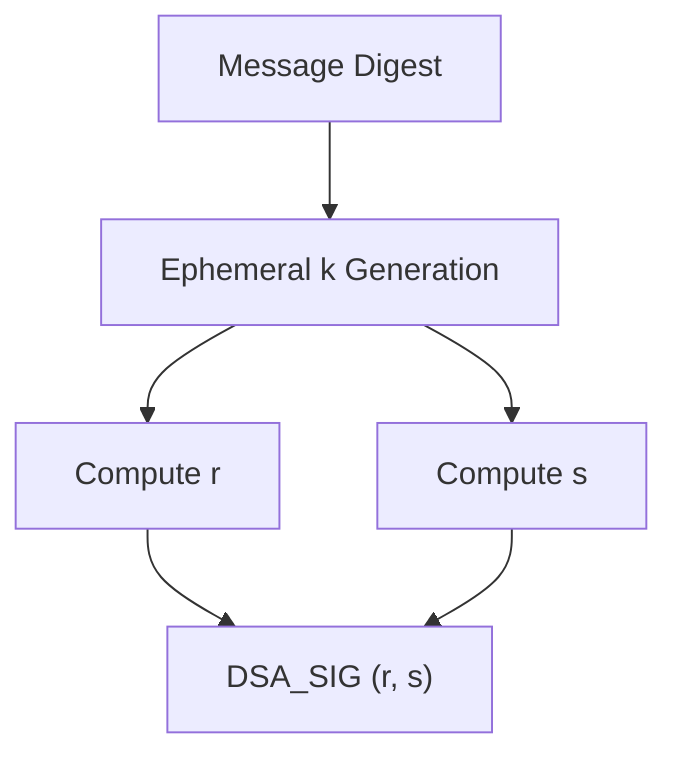
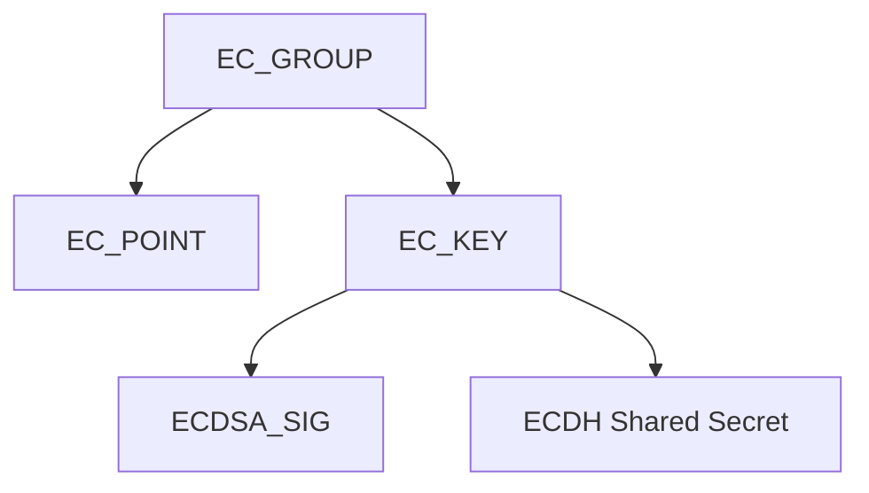
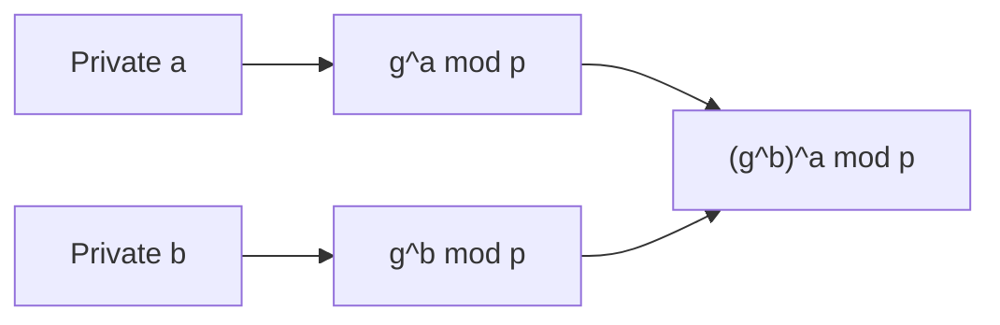
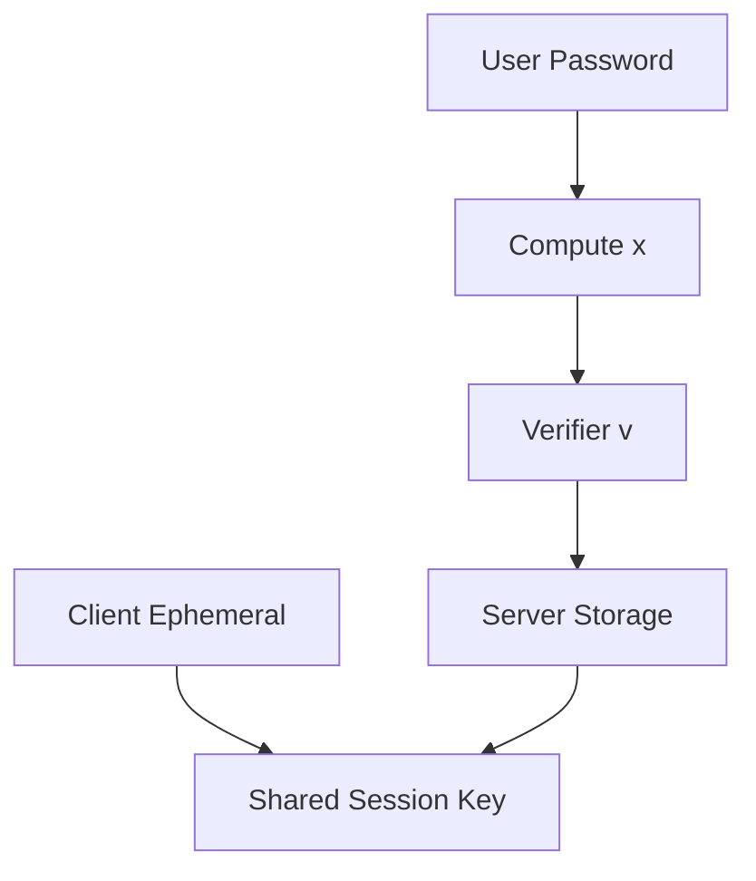
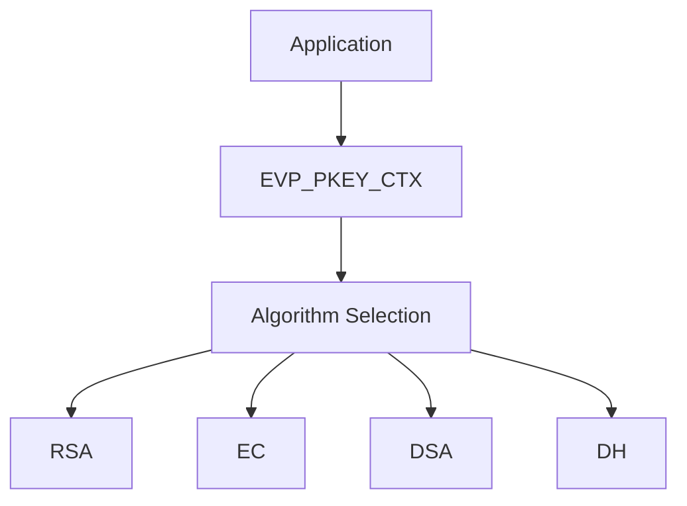

# Public Key Infrastructure

The **Public Key Infrastructure** module provides the asymmetric cryptographic foundation for OpenSSL within MeshAgent. It implements and exposes core primitives for RSA, DSA, Elliptic Curve (EC), Diffie–Hellman (DH), and Secure Remote Password (SRP), along with their parameter structures and integration into the high-level EVP abstraction layer.

This module is responsible for:

- Asymmetric key representation (RSA, DSA, EC, DH)
- Signature structures (RSA-PSS, DSA_SIG, ECDSA_SIG)
- Key exchange primitives (DH, ECDH, SRP)
- Parameter encoding (ASN.1 structures)
- Integration with `EVP_PKEY` and provider-based APIs

It forms the cryptographic backbone for higher-level modules such as TLS, X.509 certificate handling, CMS/PKCS#7, and secure key exchange protocols.

---

## 1. Architectural Overview

At a high level, the module is organized into:

- **Algorithm-specific key structures** (RSA, DSA, EC, DH)
- **Signature parameter structures** (RSA_PSS_PARAMS, DSA_SIG, ECDSA_SIG)
- **Method abstractions** (RSA_METHOD, DSA_METHOD, EC_KEY_METHOD)
- **EVP integration layer** (`evp_pkey_st`, `evp_pkey_method_st`)
- **SRP authentication primitives**

The **EVP layer** abstracts algorithm-specific implementations, allowing uniform usage across TLS, CMS, and other subsystems.

---

## 2. RSA Subsystem

### Core Structures

- `rsa_st` (via `evp.rsa_st`)
- `rsa_meth_st` (method dispatch)
- `rsa_pss_params_st` (RSA-PSS parameters)
- `rsa_oaep_params_st` (OAEP parameters)

### Capabilities

- RSA key generation (including multi-prime)
- PKCS#1 v1.5 signatures and encryption
- RSA-PSS signatures
- RSA-OAEP encryption
- Blinding and constant-time exponentiation

### RSA-PSS Parameters

The `rsa_pss_params_st` structure encodes:

- Hash algorithm
- Mask generation function (MGF1)
- Salt length
- Trailer field

This structure is ASN.1-encoded and embedded into algorithm identifiers for X.509 and CMS usage.

RSA integrates tightly with `EVP_PKEY_CTX` for configurable padding, salt length, and digest selection.

---

## 3. DSA Subsystem

### Core Structures

- `dsa_st`
- `dsa_method`
- `DSA_SIG` / `DSA_SIG_st`

### Responsibilities

- DSA parameter generation (p, q, g)
- DSA signature creation and verification
- ASN.1 encoding of signature pairs (r, s)

DSA is exposed through the EVP interface and may be used by legacy X.509 certificates and signature schemes.

---

## 4. Elliptic Curve Cryptography (ECC)

### Core Structures

- `EC_METHOD`
- `EC_GROUP`
- `EC_POINT`
- `ECPARAMETERS`
- `ECPKPARAMETERS`
- `ECDSA_SIG`
- `ec_key_st`

### Functional Areas

- Named curve management
- Group arithmetic
- ECDSA signatures
- ECDH key exchange
- Point encoding (compressed/uncompressed)

ECC supports both:

- Explicit curve parameters (ASN.1 ECPARAMETERS)
- Named curves (NID-based selection)

Integration with `EVP_PKEY` allows algorithm-agnostic signing and key exchange.

---

## 5. Diffie–Hellman (DH)

### Core Structures

- `dh_st`
- `dh_method`
- Big number helpers (`bn_mont_ctx_st`, `bn_recp_ctx_st`, `bn_blinding_st`)

### Responsibilities

- Parameter-based key exchange
- Modular exponentiation over large primes
- Shared secret derivation

DH is used directly or wrapped via EVP for TLS and other key exchange protocols.

---

## 6. Secure Remote Password (SRP)

### Core Structures

- `SRP_VBASE`
- `SRP_user_pwd`
- `SRP_gN`
- `SRP_gN_cache`

### Role

SRP provides password-authenticated key exchange without transmitting passwords. It builds on:

- Large safe primes (N)
- Generator values (g)
- Verifier-based authentication

SRP integrates with OpenSSL’s big number and DH primitives.

---

## 7. EVP Integration Layer

The Public Key Infrastructure module is surfaced through `EVP_PKEY` and related context objects:

- `evp_pkey_st`
- `evp_pkey_method_st`
- `evp_pkey_asn1_method_st`
- `EVP_PKEY_CTX`

### Abstraction Flow

This abstraction ensures:

- Provider-based algorithm dispatch
- Pluggable backends
- Uniform signing and verification APIs
- Decoupling of ASN.1 encoding from algorithm math

---

## 8. Security Considerations

The module enforces multiple security protections:

- Constant-time exponentiation for private key operations
- RSA blinding against timing attacks
- Minimum key size recommendations (e.g., RSA FIPS minimum bits)
- Validation checks for group parameters
- Protection flags (FIPS mode indicators)

Key structures are reference-counted and often opaque to prevent misuse.

---

## 9. Relationship to Other Modules

The Public Key Infrastructure module underpins:

- TLS and SSL handshake authentication
- X.509 certificate verification
- CMS / PKCS#7 message signing and encryption
- OCSP and timestamp validation

It provides the asymmetric primitives that higher-level trust and transport modules rely upon.

---

# Summary

The **Public Key Infrastructure** module provides the core asymmetric cryptographic engine for OpenSSL in MeshAgent. It:

- Implements RSA, DSA, EC, DH, and SRP
- Encodes and manages ASN.1 parameters
- Integrates with the EVP abstraction layer
- Supplies cryptographic primitives for TLS, certificates, and secure messaging

It is a foundational security component that enables authentication, digital signatures, and secure key exchange across the entire stack.
