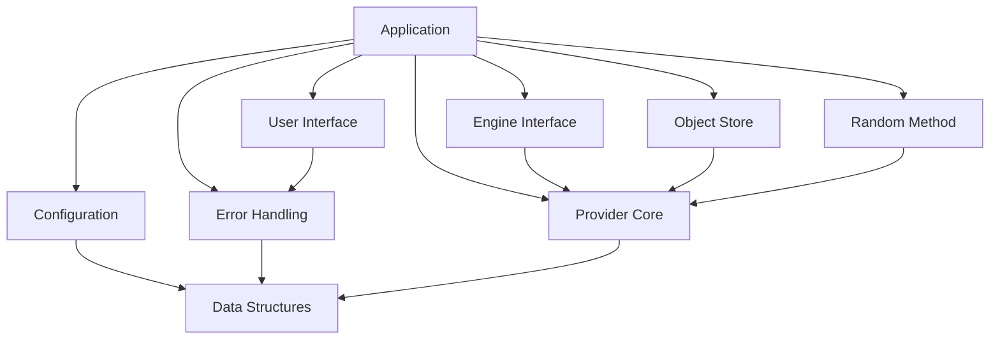
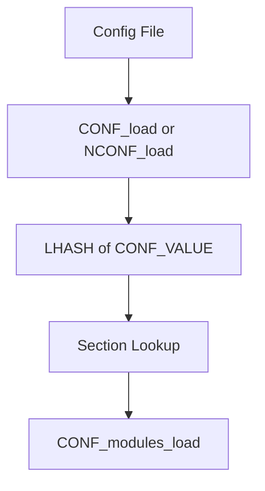
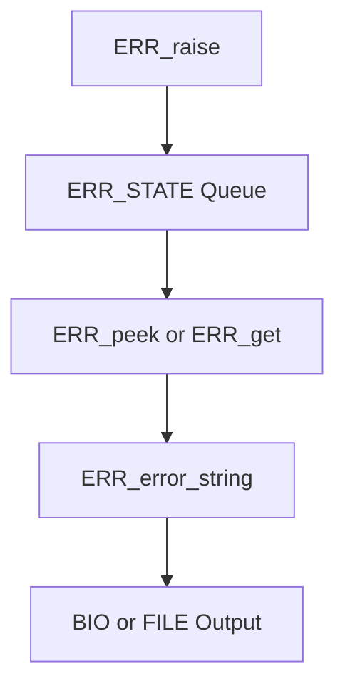
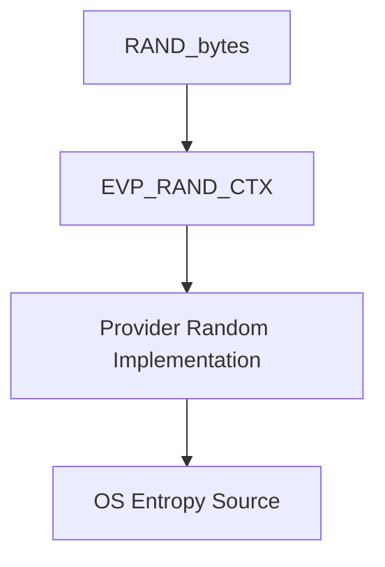
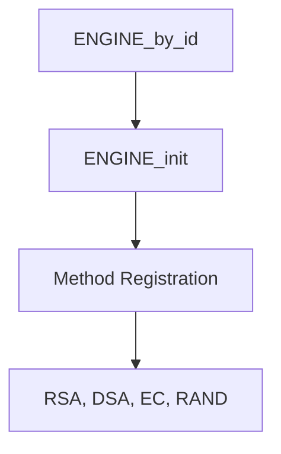
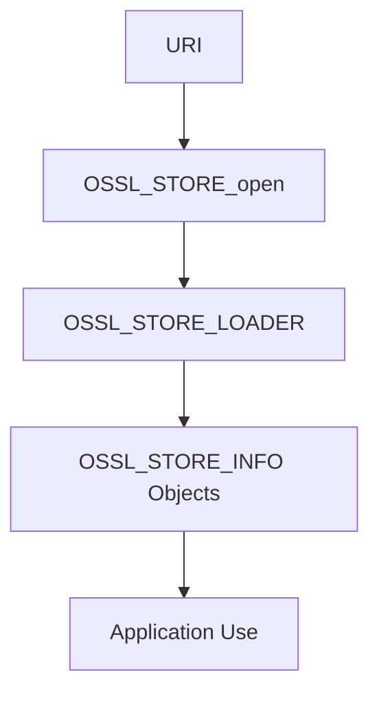
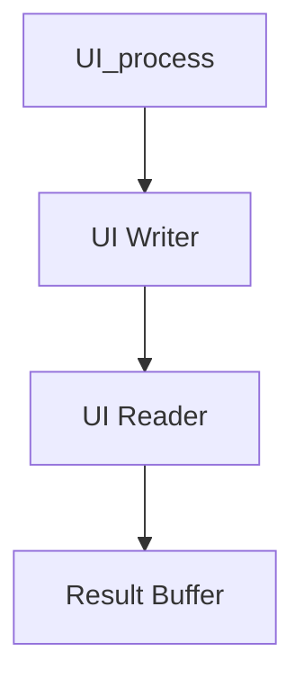
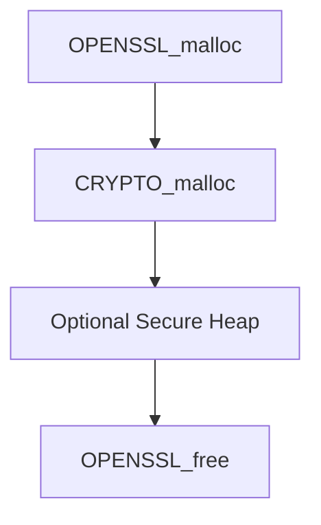
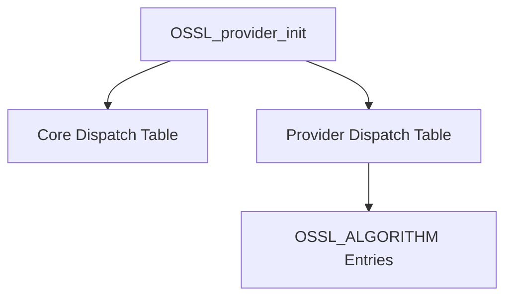
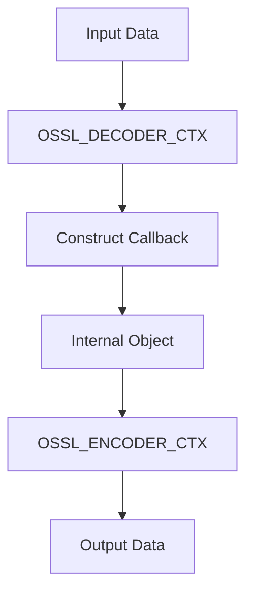

# Supporting Infrastructure

The **Supporting Infrastructure** module provides the foundational runtime services that enable OpenSSL subsystems to operate cohesively. It includes configuration management, error handling, random number method abstraction, legacy engine integration, object and name registries, generic data structures (hash tables and stacks), text databases, user interaction APIs, threading and memory primitives, core provider dispatch types, and modern encoder/decoder plumbing.

This module does not implement cryptographic primitives directly. Instead, it supplies the cross-cutting services required by higher-level modules such as TLS, X.509, CMS, CMP/CRMF, and the Provider framework.

---

## Architectural Overview

The Supporting Infrastructure layer acts as a shared services backbone:

- **Configuration** initializes modules and providers.
- **Error Handling** standardizes diagnostics across subsystems.
- **Random Method** abstracts entropy and DRBG selection.
- **Engine Interface** integrates legacy hardware/software engines.
- **Object Store** loads keys, certificates, and CRLs.
- **Core Provider Types** define dispatch and parameter exchange.
- **Data Structures** provide reusable containers and registries.

---

## Configuration Subsystem

**Key types:** `CONF`, `CONF_METHOD`, `CONF_MODULE`, `CONF_IMODULE`, `CONF_VALUE`

The configuration layer parses and manages OpenSSL configuration files and module initialization.

### Responsibilities

- Load configuration from file, BIO, or memory
- Provide section-based key-value access
- Initialize dynamically registered modules
- Support application-specific configuration contexts

### Design Notes

- Backed by `OPENSSL_LHASH` for fast key lookups
- Supports per-library contexts via `OSSL_LIB_CTX`
- Allows runtime module registration via `CONF_module_add`

---

## Error Handling Framework

**Key types:** `ERR_STATE`, `ERR_STRING_DATA`

The error subsystem centralizes error reporting across all OpenSSL libraries.

### Characteristics

- Thread-local error queues
- Encoded 32-bit error values
- Library + reason separation
- Optional fatal and common flags

### Architectural Role

- Provides consistent diagnostics across crypto, SSL, ASN.1, CMP, and providers
- Integrates with configuration and UI subsystems
- Supports error stack save and restore

---

## Random Method Abstraction

**Key type:** `RAND_METHOD`

The random infrastructure abstracts entropy and deterministic random bit generators.

### Legacy and Modern Paths

- Legacy: `RAND_METHOD` callbacks
- Modern: Provider-based `EVP_RAND` implementations

### Responsibilities

- Public and private random streams
- Configurable DRBG type and seed source
- Per-context randomness via `OSSL_LIB_CTX`

---

## Engine Interface

**Key types:** `ENGINE`, `ENGINE_CMD_DEFN`, `dynamic_fns`

The engine subsystem enables pluggable cryptographic implementations, often hardware-backed.

### Capabilities

- Method registration for RSA, DSA, EC, RAND, ciphers, digests
- Dynamic loading support
- Command-based configuration
- Legacy compatibility layer

### Modern Context

While engines are deprecated in favor of providers, they remain part of the supporting infrastructure for backward compatibility.

---

## Object Store Framework

**Key types:** `OSSL_STORE_CTX`, `OSSL_STORE_LOADER`

The store subsystem provides a URI-based abstraction for loading keys and certificates.

### Features

- Scheme-based loader selection
- BIO or URI input
- Iterative object retrieval
- Pluggable loader registration

---

## Generic Data Structures

Supporting Infrastructure includes reusable containers used throughout OpenSSL.

### Hash Table

**Types:** `OPENSSL_LHASH`, `OPENSSL_LH_NODE`

- Generic, type-safe wrappers
- Used by configuration and error string registries

### Stack

**Type:** `OPENSSL_STACK`

- Dynamically sized array container
- Used extensively for certificate chains and extension lists

### Text Database

**Type:** `TXT_DB`

- Structured flat-file database
- Used in certificate authority workflows

---

## Object Name Registry

**Type:** `OBJ_NAME`

The object registry maps names to algorithm implementations and identifiers.

### Uses

- Algorithm name to NID resolution
- Alias support
- Method lookup by name

---

## User Interface Abstraction

**Types:** `UI`, `UI_STRING`

The UI subsystem abstracts interactive prompting for passwords and confirmations.

### Design

- Method-driven architecture
- Console or custom UI backends
- Passphrase callback integration

---

## Threading and Memory Core

**Key types:** `CRYPTO_RWLOCK`, `CRYPTO_EX_DATA`, `CRYPTO_THREAD_LOCAL`

The crypto core layer provides:

- Read/write locks
- Atomic operations
- Thread-local storage
- Secure memory allocation
- Ex-data extensibility framework

### Memory Flow

---

## Provider Core Types

**Key types:** `OSSL_CORE_HANDLE`, `OSSL_DISPATCH`, `OSSL_ALGORITHM`, `OSSL_PARAM`

These structures define the contract between libcrypto and providers.

### Responsibilities

- Dispatch tables for function exchange
- Algorithm advertisement
- Parameterized data passing
- Provider initialization handshake

---

## Encoder and Decoder Framework

**Key types:** `OSSL_ENCODER_INSTANCE`, `OSSL_DECODER_INSTANCE`

These APIs provide flexible object transformation pipelines.

### Capabilities

- Fetch encoders and decoders by name
- Chain multiple implementations
- Support passphrase callbacks
- BIO, FILE, and memory-based I/O

---

## HPKE and Advanced Protocol Helpers

**Key types:** `OSSL_HPKE_CTX`, `OSSL_HPKE_SUITE`

The module also exposes structured protocol helpers such as Hybrid Public Key Encryption, enabling higher-level cryptographic protocols while relying on the same core dispatch and provider mechanisms.

---

## How It Fits Into the OpenSSL Architecture

The Supporting Infrastructure module underpins every higher-level subsystem:

- TLS depends on configuration, error handling, RNG, and object loading.
- X.509 and PKI rely on stacks, hash tables, object registries, and store loaders.
- Providers use core dispatch structures and parameter APIs.
- CMP/CRMF and CMS use text databases, UI prompts, and error queues.

It forms the **non-cryptographic backbone** that allows cryptographic modules to remain modular, pluggable, and provider-driven.

---

## Summary

Supporting Infrastructure provides:

- Configuration and module loading
- Centralized error management
- Randomness abstraction
- Legacy engine integration
- URI-based object loading
- Generic container data structures
- Threading and secure memory primitives
- Provider dispatch and parameter exchange
- Encoding and decoding pipelines

Without this layer, OpenSSL would lack the orchestration mechanisms required to coordinate algorithms, providers, configuration, and runtime state.