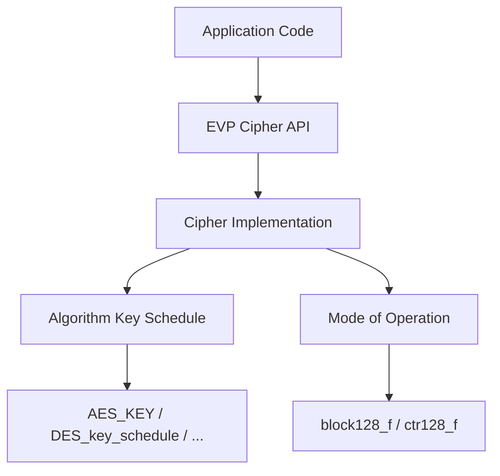
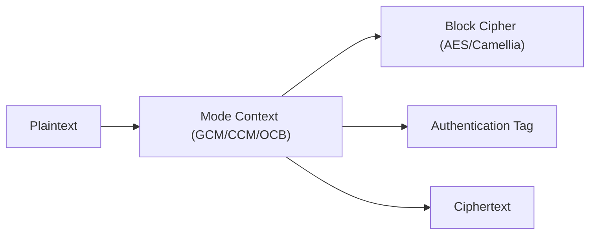
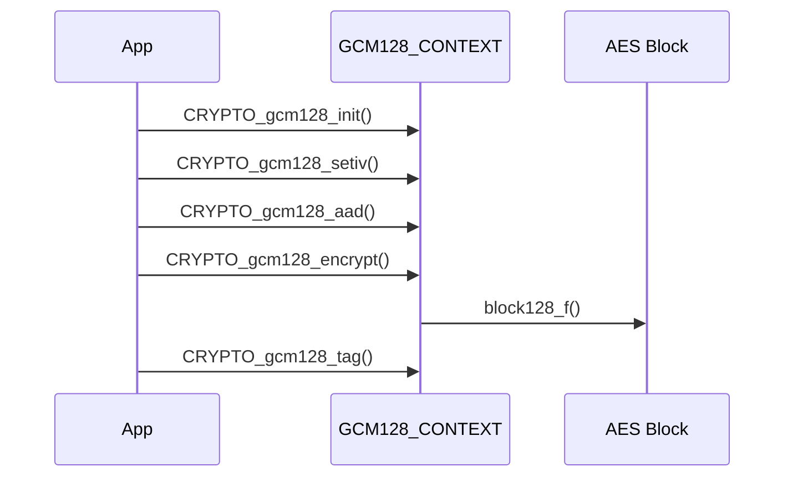
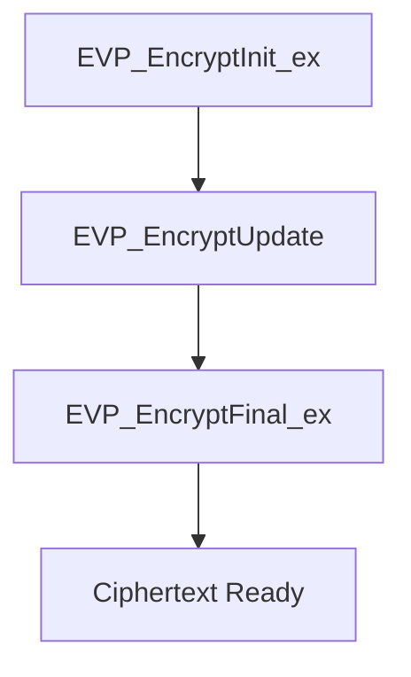
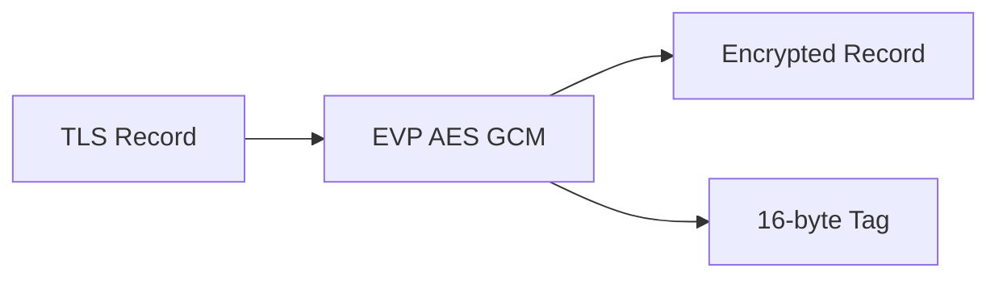
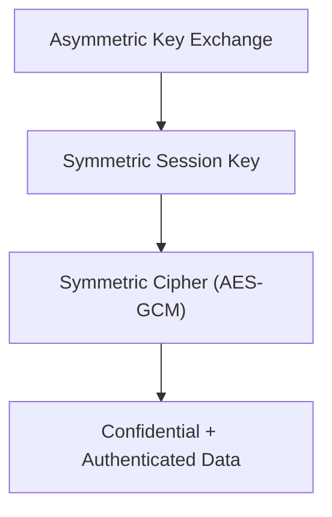

# Symmetric Ciphers

The **Symmetric Ciphers** module provides low-level and high-level cryptographic primitives for symmetric-key encryption within the OpenSSL integration used by MeshAgent. It includes classic block and stream ciphers, modern authenticated encryption modes, and the EVP abstraction layer for algorithm-agnostic usage.

This module underpins secure communication channels (e.g., TLS), data-at-rest protection, key wrapping, and internal secure messaging across the platform.

---

## 1. Purpose and Scope

The Symmetric Ciphers module:

- Defines cipher-specific key schedule structures (e.g., `AES_KEY`, `DES_key_schedule`).
- Exposes legacy low-level APIs (e.g., `AES_encrypt`, `DES_cbc_encrypt`).
- Provides modern authenticated encryption modes (GCM, CCM, OCB, XTS).
- Integrates with the high-level **EVP** interface for uniform cipher handling.
- Supplies TLS-specific multiblock and AEAD control parameters.

It works closely with:

- Digest and MAC primitives (for AEAD and HMAC-based constructions).
- Public Key Infrastructure (for hybrid encryption and key exchange).
- TLS and SSL (for secure session encryption).

---

## 2. Module Architecture

The module is structured in three conceptual layers:

1. **Algorithm-Specific Key Schedules** (AES, DES, Blowfish, etc.)
2. **Mode Implementations** (CBC, CTR, GCM, CCM, XTS, OCB)
3. **EVP Abstraction Layer** (algorithm-agnostic interface)

---

## 3. Algorithm-Specific Key Structures

Each symmetric cipher defines a key schedule structure that stores expanded round keys and configuration parameters.

### 3.1 AES

Defined in `aes.h`:

- `struct aes_key_st`
- `typedef AES_KEY`

Key characteristics:

- `rd_key[]`: Expanded round keys
- `rounds`: Number of rounds (up to 14)
- `AES_BLOCK_SIZE = 16`

Supported legacy operations:

- `AES_set_encrypt_key()`
- `AES_encrypt()` / `AES_decrypt()`
- Modes: ECB, CBC, CFB, OFB, IGE, key wrapping

---

### 3.2 DES and Triple DES

Defined in `des.h`:

- `DES_key_schedule`
- `DES_ks`

Features:

- 8-byte block size
- Multiple triple-DES variants (EDE2, EDE3)
- CBC, CFB, OFB, PCBC modes
- Parity checks and weak key detection

---

### 3.3 Other Supported Ciphers

| Cipher     | Key Structure              | Block Size |
|------------|---------------------------|------------|
| Blowfish   | `BF_KEY`                  | 8 bytes    |
| CAST5      | `CAST_KEY`                | 8 bytes    |
| IDEA       | `IDEA_KEY_SCHEDULE`       | 8 bytes    |
| RC2        | `RC2_KEY`                 | 8 bytes    |
| RC4        | `RC4_KEY` (stream cipher) | Stream     |
| RC5        | `RC5_32_KEY`              | 8 bytes    |
| Camellia   | `CAMELLIA_KEY`            | 16 bytes   |
| SEED       | `SEED_KEY_SCHEDULE`       | 16 bytes   |

These are primarily exposed via legacy APIs and are superseded in modern usage by the EVP layer.

---

## 4. Modes of Operation

Defined in `modes.h`, the module provides generic mode implementations that operate on block cipher primitives.

### 4.1 Generic Mode Function Types

- `block128_f`
- `cbc128_f`
- `ctr128_f`
- `ccm128_f`

These abstract the block transformation from the chaining logic.

### 4.2 Authenticated Encryption Contexts

The module defines opaque contexts:

- `GCM128_CONTEXT`
- `CCM128_CONTEXT`
- `OCB128_CONTEXT`
- `XTS128_CONTEXT`

### 4.3 Example: GCM Flow

---

## 5. EVP Abstraction Layer

The EVP API (in `evp.h`) provides a uniform interface across all symmetric ciphers.

### 5.1 Core Structures

- `EVP_CIPHER`
- `EVP_CIPHER_CTX`
- `EVP_CIPHER_INFO`
- `EVP_CTRL_TLS1_1_MULTIBLOCK_PARAM`

### 5.2 Cipher Lifecycle

EVP abstracts:

- Key setup
- IV handling
- Padding
- AEAD tag generation/verification
- TLS-specific controls

### 5.3 Mode Selection Flags

Defined as bit flags:

- `EVP_CIPH_CBC_MODE`
- `EVP_CIPH_CTR_MODE`
- `EVP_CIPH_GCM_MODE`
- `EVP_CIPH_CCM_MODE`
- `EVP_CIPH_XTS_MODE`
- `EVP_CIPH_OCB_MODE`

This allows runtime selection and provider-based dispatch.

---

## 6. TLS Integration

The module defines TLS-related constants and structures:

- `EVP_GCM_TLS_TAG_LEN`
- `EVP_CCM_TLS_IV_LEN`
- `EVP_CTRL_TLS1_1_MULTIBLOCK_PARAM`

These are used by the TLS and SSL module to secure session traffic.

---

## 7. Buffer Management

The `buf_mem_st` structure (from `buffer.h`) provides dynamic memory handling for encryption buffers:

- `length`: Current data length
- `data`: Pointer to buffer
- `max`: Allocated size
- `flags`: Security flags (e.g., secure memory)

This ensures controlled allocation and secure cleanup for sensitive material.

---

## 8. Relationship to Other Modules

The Symmetric Ciphers module interacts with:

- **Digest and MAC** – for HMAC, CMAC, and AEAD constructions.
- **Public Key Infrastructure** – for hybrid encryption and key exchange.
- **TLS and SSL** – for record-layer encryption.
- **Type System** – for shared OpenSSL type definitions.

Symmetric cryptography typically follows this layered model:

---

## 9. Security Considerations

- Prefer AEAD modes (GCM, CCM, OCB) over legacy CBC + MAC constructions.
- Avoid deprecated low-level APIs (`AES_encrypt`, `DES_encrypt1`, etc.) in new code.
- Use EVP-based APIs for provider compatibility and FIPS alignment.
- Ensure IV uniqueness in CTR/GCM modes.
- Use secure memory buffers for key material where possible.

---

## 10. Summary

The **Symmetric Ciphers** module forms the cryptographic core for confidential and authenticated data processing. It:

- Implements multiple cipher families.
- Provides flexible mode implementations.
- Integrates seamlessly with the EVP abstraction.
- Enables secure TLS and application-level encryption.

It is a foundational component of the overall OpenSSL integration and a critical building block for secure communication and data protection within the MeshAgent architecture.
