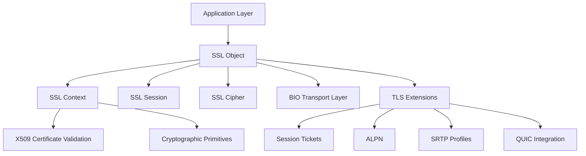
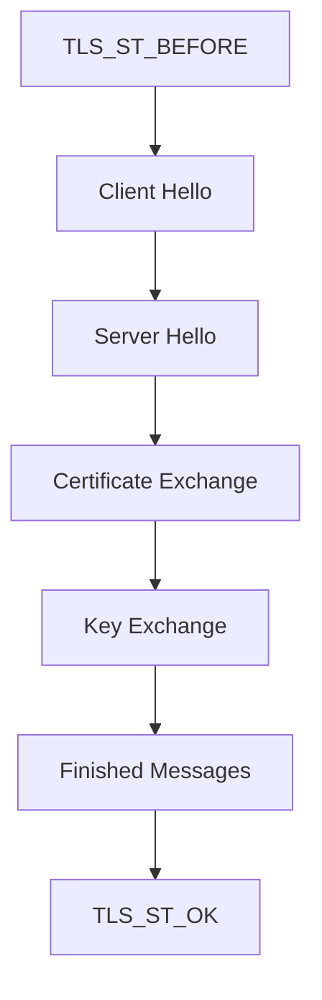
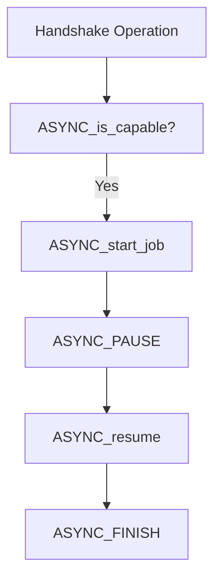

# Tls And Ssl

The **Tls And Ssl** module provides the core Transport Layer Security (TLS) and Secure Sockets Layer (SSL) protocol implementation for the OpenSSL integration used by MeshAgent. It exposes the primary APIs, data structures, configuration controls, handshake state machine, session management, and QUIC/TLS extensions required to establish secure channels.

This module centers around the `SSL`, `SSL_CTX`, `SSL_SESSION`, and `SSL_METHOD` abstractions and coordinates cryptographic primitives, certificate validation, protocol negotiation, and transport I/O.

---

## 1. Architectural Overview

At a high level, Tls And Ssl sits above cryptographic primitives and below application protocols. It orchestrates handshake negotiation, cipher selection, certificate validation, and secure record transport.

### Core Structures

| Structure | Role |
|------------|------|
| `ssl_st` (SSL) | Represents a single TLS/SSL connection |
| `ssl_ctx_st` (SSL_CTX) | Shared configuration context for multiple SSL connections |
| `ssl_session_st` (SSL_SESSION) | Session state for resumption and tickets |
| `ssl_method_st` (SSL_METHOD) | Protocol method (TLS, DTLS, version negotiation) |
| `ssl_cipher_st` (SSL_CIPHER) | Cipher suite definition |
| `SSL_CONF_CTX` | Runtime configuration command processor |
| `TLS_SESSION_TICKET_EXT` | TLS session ticket extension payload |
| `ASYNC_JOB`, `ASYNC_WAIT_CTX` | Asynchronous cryptographic execution support |

---

## 2. SSL Context and Connection Lifecycle

### 2.1 SSL_CTX – Global Configuration

`SSL_CTX` defines reusable configuration shared across connections:

- Protocol versions (min/max)
- Cipher lists and TLS 1.3 ciphersuites
- Certificate chains and private keys
- Verification policies
- Session cache behavior
- ALPN/NPN callbacks
- Custom extensions
- Security level and callback policies

Creation:

- `SSL_CTX_new()`
- `SSL_CTX_new_ex()` (with provider context)

Configuration examples:

- `SSL_CTX_set_cipher_list()`
- `SSL_CTX_set_ciphersuites()`
- `SSL_CTX_set_verify()`
- `SSL_CTX_set_options()`
- `SSL_CTX_set_security_level()`

---

### 2.2 SSL – Per-Connection State

An `SSL` object represents one secure connection.

Creation and setup:

- `SSL_new(ctx)`
- `SSL_set_fd()` or `SSL_set_bio()`
- `SSL_set_connect_state()` (client)
- `SSL_set_accept_state()` (server)

Handshake entry points:

- `SSL_connect()`
- `SSL_accept()`
- `SSL_do_handshake()`

Data transfer:

- `SSL_read()` / `SSL_read_ex()`
- `SSL_write()` / `SSL_write_ex()`
- `SSL_shutdown()`

---

## 3. TLS Handshake State Machine

The handshake state is tracked via `OSSL_HANDSHAKE_STATE`.

Handshake states cover:

- ClientHello
- ServerHello
- Certificate
- KeyExchange
- ChangeCipherSpec
- Finished
- TLS 1.3 EncryptedExtensions
- KeyUpdate
- Early Data phases

State inspection:

- `SSL_get_state()`
- `SSL_in_init()`
- `SSL_is_init_finished()`

---

## 4. Cipher Suite and Negotiation Model

### 4.1 SSL_CIPHER

`SSL_CIPHER` describes a negotiated suite:

- Key exchange algorithm (RSA, ECDHE, DHE, PSK)
- Authentication algorithm (RSA, ECDSA, etc.)
- Bulk encryption (AES-GCM, CHACHA20-POLY1305, etc.)
- Digest / AEAD properties

Query APIs:

- `SSL_get_current_cipher()`
- `SSL_CIPHER_get_name()`
- `SSL_CIPHER_get_bits()`
- `SSL_CIPHER_get_kx_nid()`
- `SSL_CIPHER_get_auth_nid()`

Cipher list configuration strings use tokens such as:

- HIGH
- AES128
- ECDHE
- CHACHA20
- COMPLEMENTOFDEFAULT

TLS 1.3 uses explicit ciphersuite configuration via:

- `SSL_CTX_set_ciphersuites()`

---

## 5. Session Management and Resumption

### 5.1 SSL_SESSION

An `SSL_SESSION` stores:

- Session ID
- Cipher
- Master key
- Ticket information
- ALPN selection
- Peer certificate reference
- Early data allowance

Session APIs:

- `SSL_get_session()`
- `SSL_set_session()`
- `SSL_SESSION_get_id()`
- `SSL_SESSION_set_timeout()`

### 5.2 Session Cache Modes

- `SSL_SESS_CACHE_OFF`
- `SSL_SESS_CACHE_CLIENT`
- `SSL_SESS_CACHE_SERVER`
- `SSL_SESS_CACHE_BOTH`

Control:

- `SSL_CTX_set_session_cache_mode()`

---

## 6. TLS Extensions Framework

Tls And Ssl supports both built-in and custom extensions.

### Built-in Extensions

Defined in TLS 1.x and TLS 1.3:

- SNI (server_name)
- ALPN
- Session Ticket
- Extended Master Secret
- Signature Algorithms
- Supported Groups
- PSK
- Early Data
- Certificate Compression
- QUIC Transport Parameters

### Custom Extension Hooks

Register via:

- `SSL_CTX_add_client_custom_ext()`
- `SSL_CTX_add_server_custom_ext()`
- `SSL_CTX_add_custom_ext()`

Callbacks:

- Add
- Parse
- Free

---

## 7. TLS Session Tickets

Session ticket support is encapsulated via:

- `TLS_SESSION_TICKET_EXT`
- Ticket callbacks
- Renew/ignore policies

Ticket status codes include:

- `SSL_TICKET_NONE`
- `SSL_TICKET_SUCCESS`
- `SSL_TICKET_SUCCESS_RENEW`

This enables stateless resumption.

---

## 8. Verification and Security Policies

### Verification Modes

- `SSL_VERIFY_NONE`
- `SSL_VERIFY_PEER`
- `SSL_VERIFY_FAIL_IF_NO_PEER_CERT`
- `SSL_VERIFY_POST_HANDSHAKE`

Set via:

- `SSL_set_verify()`
- `SSL_CTX_set_verify()`

### Security Levels

Security policy enforcement includes:

- Minimum key sizes
- Cipher restrictions
- Curve validation
- Signature algorithm filtering

Control via:

- `SSL_set_security_level()`
- `SSL_CTX_set_security_callback()`

---

## 9. Asynchronous Operation

Tls And Ssl integrates with OpenSSL's async subsystem.

Core types:

- `ASYNC_JOB`
- `ASYNC_WAIT_CTX`

Flow:

This allows offloading cryptographic operations (e.g., hardware engines or async providers).

---

## 10. QUIC Integration

The module provides QUIC-TLS integration points:

- `SSL_handle_events()`
- Stream APIs (`SSL_new_stream()`, `SSL_accept_stream()`)
- Connection listener APIs
- Transport parameter configuration

It enables TLS 1.3 handshake reuse inside QUIC while separating record layer responsibilities.

---

## 11. Relationship to Other OpenSSL Modules

Tls And Ssl depends on:

- [Type System](../Type System/Type System.md)
- [Digest and MAC](../Digest and MAC/Digest and MAC.md)
- [Symmetric Ciphers](../Symmetric Ciphers/Symmetric Ciphers.md)
- [Public Key Infrastructure](../Public Key Infrastructure/Public Key Infrastructure.md)
- [X.509 and Certificate Management](../X.509 and Certificate Management/X.509 and Certificate Management.md)
- [ASN.1 Engine](../ASN.1 Engine/ASN.1 Engine.md)
- [BIO and IO](../BIO and IO/BIO and IO.md)
- [Supporting Infrastructure](../Supporting Infrastructure/Supporting Infrastructure.md)

These modules provide cryptographic primitives, certificate parsing, key handling, and low-level I/O abstractions required by the TLS state machine.

---

## 12. End-to-End Flow Summary

The **Tls And Ssl** module provides:

- Full TLS 1.0–1.3 and DTLS support
- Session resumption and ticket management
- Extension and custom extension handling
- Verification and security policy enforcement
- Async and QUIC integration

It forms the core secure transport layer for all higher-level networking components within the OpenSSL-backed MeshAgent stack.
