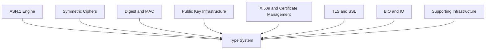
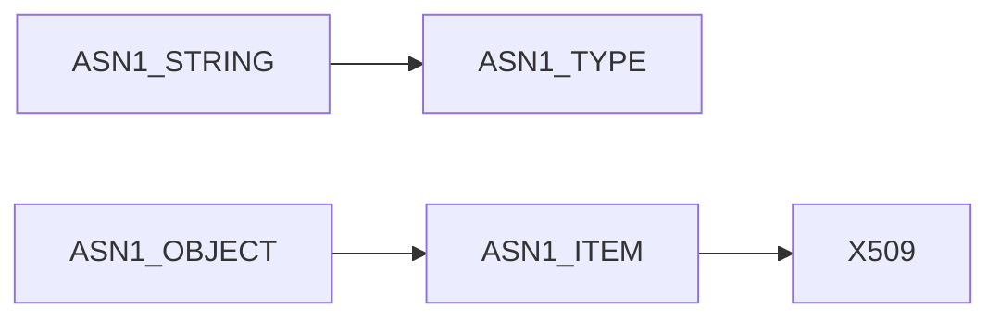
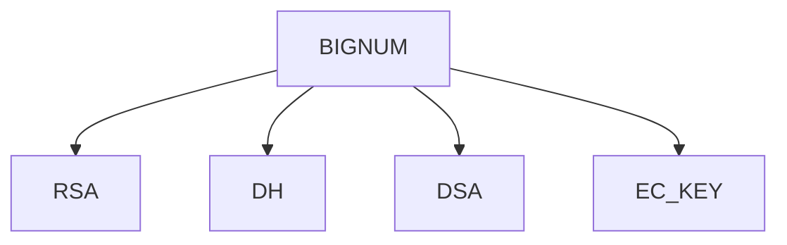
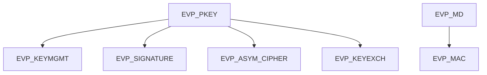
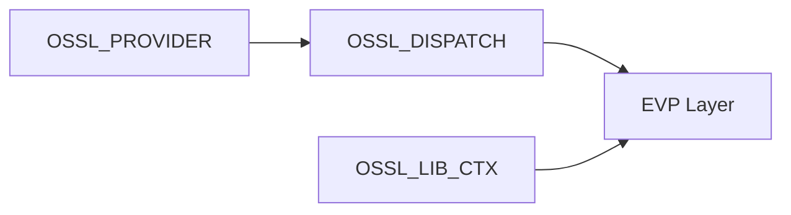
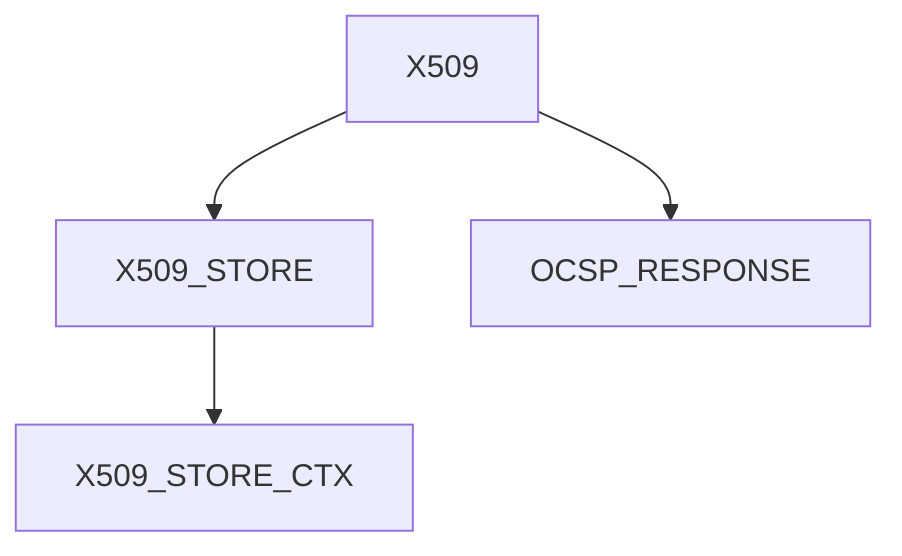
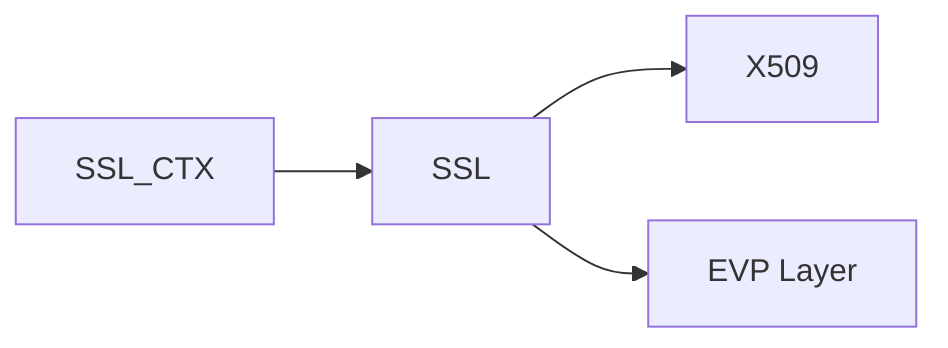
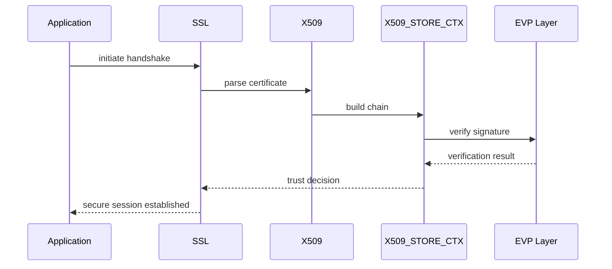
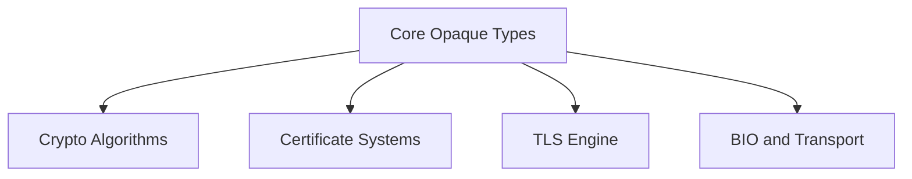

# Type System

The **Type System** module defines the foundational data structures and opaque handles used throughout the OpenSSL integration in MeshAgent. It acts as the canonical type declaration layer for cryptographic primitives, ASN.1 objects, TLS/SSL sessions, X.509 certificates, provider interfaces, and the modern OpenSSL 3.x object model.

Rather than implementing cryptographic algorithms directly, the Type System establishes **forward declarations and structural contracts** that other modules depend on. This separation enables encapsulation, ABI stability, provider extensibility, and strict layering across the OpenSSL stack.

---

## Purpose and Design Principles

The Type System provides:

- **Opaque struct declarations** (e.g., `EVP_PKEY`, `SSL_CTX`, `X509`)
- **Provider and dispatch interfaces** (`OSSL_PROVIDER`, `OSSL_DISPATCH`)
- **Modern EVP abstractions** (`EVP_MAC`, `EVP_KDF`, `EVP_SIGNATURE`, etc.)
- **ASN.1 core primitives** (`ASN1_STRING`, `ASN1_OBJECT`, `ASN1_TYPE`)
- **PKI object models** (certificate stores, policies, revocation objects)
- **Context-based execution models** (`OSSL_LIB_CTX`, `EVP_PKEY_CTX`, etc.)

The architectural goals are:

1. **Encapsulation** – Internal struct layouts are hidden from consumers.
2. **Binary Compatibility** – Applications compile against stable forward declarations.
3. **Provider Abstraction** – Algorithms are loaded dynamically via providers.
4. **Layered Design** – Cryptographic, TLS, PKI, and encoding systems share common types.

---

## Architectural Position

The Type System sits at the center of the OpenSSL module tree.



Every higher-level module relies on the opaque type definitions declared here.

Related modules:

- [ASN.1 Engine](ASN.1 Engine/ASN.1 Engine.md)
- [Symmetric Ciphers](Symmetric Ciphers/Symmetric Ciphers.md)
- [Digest and MAC](Digest and MAC/Digest and MAC.md)
- [Public Key Infrastructure](Public Key Infrastructure/Public Key Infrastructure.md)
- [X.509 and Certificate Management](X.509 and Certificate Management/X.509 and Certificate Management.md)
- [TLS and SSL](TLS and SSL/TLS and SSL.md)
- [BIO and IO](BIO and IO/BIO and IO.md)
- [Supporting Infrastructure](Supporting Infrastructure/Supporting Infrastructure.md)

---

## Core Type Categories

### 1. ASN.1 and Encoding Primitives

These types model DER/BER encoded structures used in certificates and keys:

- `ASN1_STRING`, `ASN1_INTEGER`, `ASN1_TIME`
- `ASN1_OBJECT`
- `ASN1_TYPE`
- `ASN1_ITEM`
- `ASN1_STRING_TABLE`

These primitives underpin certificate parsing and PKCS structures.



---

### 2. Big Number and Mathematical Core

Used by RSA, DSA, DH, and EC implementations:

- `BIGNUM`
- `BN_CTX`
- `BN_MONT_CTX`
- `BN_BLINDING`
- `BN_GENCB`



These types abstract multi-precision arithmetic without exposing internal representation.

---

### 3. EVP High-Level Abstraction Layer

The EVP layer unifies algorithm access behind generic interfaces:

- `EVP_CIPHER`, `EVP_CIPHER_CTX`
- `EVP_MD`, `EVP_MD_CTX`
- `EVP_PKEY`, `EVP_PKEY_CTX`
- `EVP_MAC`, `EVP_MAC_CTX`
- `EVP_KDF`, `EVP_KDF_CTX`
- `EVP_SIGNATURE`
- `EVP_ASYM_CIPHER`
- `EVP_KEM`
- `EVP_KEYEXCH`
- `EVP_KEYMGMT`



This abstraction allows provider-backed implementations without application changes.

---

### 4. Provider and Modern OpenSSL 3.x Model

OpenSSL 3.x introduces a provider-based architecture:

- `OSSL_PROVIDER`
- `OSSL_LIB_CTX`
- `OSSL_DISPATCH`
- `OSSL_ALGORITHM`
- `OSSL_PARAM`
- `OSSL_ENCODER`, `OSSL_DECODER`
- `OSSL_SELF_TEST`



The Type System defines the contracts that make runtime algorithm loading possible.

---

### 5. Public Key and PKI Types

Core cryptographic identity objects:

- `RSA`, `DSA`, `DH`, `EC_KEY`
- `X509`, `X509_STORE`, `X509_STORE_CTX`
- `X509_VERIFY_PARAM`
- `PKCS8_PRIV_KEY_INFO`
- `X509_POLICY_TREE`, `X509_POLICY_NODE`
- `OCSP_RESPONSE`, `OCSP_RESPID`



These types enable certificate validation, revocation checking, and trust evaluation.

---

### 6. TLS and Session Types

Secure channel abstractions:

- `SSL`
- `SSL_CTX`
- `SSL_DANE`
- `SSL_SESSION` (via related modules)



TLS depends heavily on X.509 and EVP types declared here.

---

### 7. I/O and Memory Abstractions

- `BIO`
- `BUF_MEM`
- `COMP_CTX`, `COMP_METHOD`

These support streaming, buffering, and compression.

---

## Opaque Type Pattern

The Type System primarily uses forward declarations:

```c
typedef struct evp_pkey_st EVP_PKEY;
typedef struct ssl_ctx_st SSL_CTX;
typedef struct x509_st X509;
```

This pattern:

- Prevents direct struct access
- Enables internal layout changes
- Forces API-based interaction
- Maintains ABI compatibility

---

## Cross-Module Data Flow Example

Certificate verification demonstrates how these types collaborate.



Every object in this flow originates from the Type System definitions.

---

## Compatibility and Conditional Typedefs

The header includes compatibility logic:

- `NO_ASN1_TYPEDEFS` can alias multiple ASN.1 types to `ASN1_STRING`
- Deprecated algorithm types are guarded with `OPENSSL_NO_DEPRECATED_3_0`
- Windows symbol conflict mitigation (`WINCRYPT_USE_SYMBOL_PREFIX`)

This ensures portability and controlled API evolution.

---

## How the Type System Enables the Entire Stack

The Type System acts as the **shared vocabulary** of the OpenSSL integration.



Without this layer:

- EVP abstractions would not compile
- TLS could not reference certificate objects
- Providers could not expose algorithms
- PKI validation could not operate

---

## Summary

The **Type System** module is the foundational contract layer of the OpenSSL integration. It defines:

- Cryptographic primitive handles
- ASN.1 structural types
- Provider interfaces
- TLS session objects
- PKI and certificate stores
- Context-based execution models

It does not implement functionality—it **defines the structural backbone** that every other OpenSSL-related module builds upon.

For detailed behavior and implementations, refer to:

- [ASN.1 Engine](ASN.1 Engine/ASN.1 Engine.md)
- [Public Key Infrastructure](Public Key Infrastructure/Public Key Infrastructure.md)
- [TLS and SSL](TLS and SSL/TLS and SSL.md)
