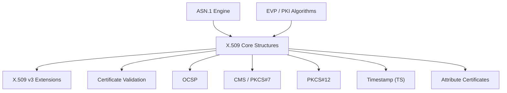
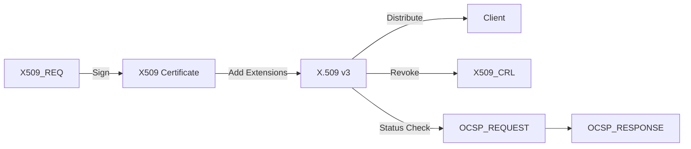
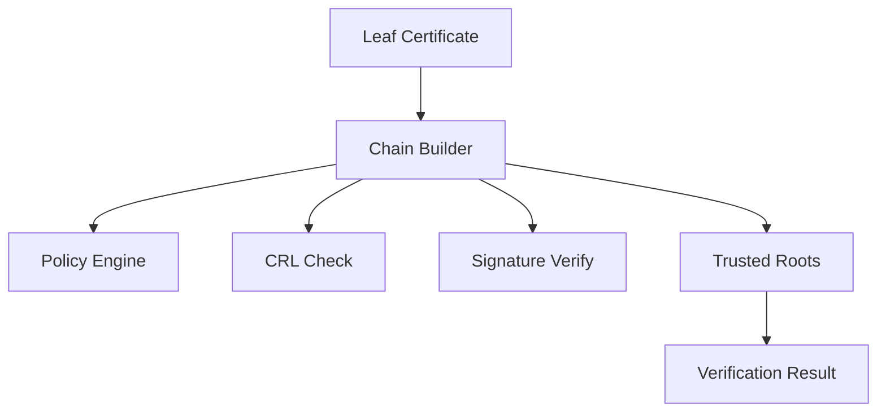
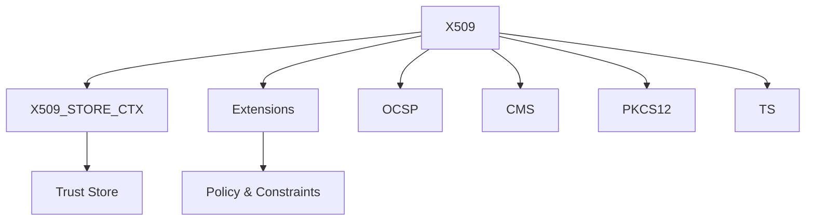

# X.509 And Certificate Management

## Overview

The **X.509 And Certificate Management** module provides the core data structures and APIs for handling digital certificates, certificate revocation lists (CRLs), certificate signing requests (CSRs), Online Certificate Status Protocol (OCSP) messages, Cryptographic Message Syntax (CMS/PKCS#7), PKCS#12 containers, timestamp tokens, and related extension frameworks.

It is built on top of:

- The OpenSSL ASN.1 engine (encoding/decoding)
- The Public Key Infrastructure (RSA, EC, DSA, EVP)
- The X.509 v3 extension framework
- Trust and verification infrastructure

This module is responsible for:

- Creating and parsing X.509 certificates
- Managing CSRs and CRLs
- Processing X.509 v3 extensions
- Validating certificate chains
- Handling OCSP and revocation status
- Managing PKCS#7 / CMS signed and encrypted data
- Importing/exporting PKCS#12 bundles
- Handling timestamp tokens (RFC 3161)
- Supporting attribute certificates and advanced extensions

---

## Architectural Positioning

The module sits above cryptographic primitives and ASN.1 encoding layers, exposing certificate-level semantics.

---

## Core Certificate Structures

Defined primarily in `x509.h`.

### X509_CINF / x509_cinf_st
Represents the **TBSCertificate** (To Be Signed Certificate) portion:

- Version
- Serial number
- Signature algorithm
- Issuer
- Validity (X509_VAL)
- Subject
- Subject public key
- Extensions

### X509_CERT_AUX / x509_cert_aux_st
Stores auxiliary trust information attached to certificates.

### X509_EXTENSION / X509_extension_st
Represents a single X.509 v3 extension.

### X509_NAME_ENTRY
Represents a single RDN component in issuer/subject names.

### X509_REQ / X509_REQ_INFO
Represents a Certificate Signing Request (CSR).

### X509_CRL_INFO
Represents the to-be-signed portion of a CRL.

### X509_PKEY
Wrapper around PKCS#8 private key information.

### X509_INFO
Container bundling certificate, CRL, and private key (used in PEM/PKCS#12 contexts).

---

## Certificate Lifecycle

---

## X.509 v3 Extension Framework

Defined in `x509v3.h`.

### v3_ext_method / X509V3_EXT_METHOD
Pluggable extension handler model:

- Decode (d2i)
- Encode (i2d)
- String conversion
- Configuration parsing

### Common Extensions

- **BASIC_CONSTRAINTS**
- **KEY_USAGE / Extended Key Usage**
- **SUBJECT_ALT_NAME (GENERAL_NAME)**
- **AUTHORITY_KEYID**
- **CRL Distribution Points (DIST_POINT)**
- **POLICYINFO / POLICY_CONSTRAINTS**
- **NAME_CONSTRAINTS**
- **PROXY_CERT_INFO_EXTENSION**

The extension context (`v3_ext_ctx`) allows:

- Linking issuer and subject
- Policy enforcement
- CRL/OCSP embedding

---

## Certificate Validation and Trust

Defined in `x509_vfy.h`.

### X509_TRUST
Defines trust policies and trust checking callbacks.

### X509_STORE / X509_STORE_CTX
Core validation engine:

- Chain building
- CRL checks
- Policy enforcement
- Time validation
- Signature verification
- Hostname/email/IP matching

Validation errors are represented by `X509_V_ERR_*` codes.

---

## OCSP (Online Certificate Status Protocol)

Defined in `ocsp.h`.

### Core Structures

- **OCSP_CERTID** – identifies certificate via issuer + serial
- **OCSP_REQUEST** – status query
- **OCSP_BASICRESP** – signed response
- **OCSP_SINGLERESP** – per-certificate result
- **OCSP_RESPDATA** – response data container

Supports:

- Nonce handling
- Signature verification
- Revocation reason extraction

---

## CMS / PKCS#7

Defined in `cms.h` and `pkcs7.h`.

### CMS_ContentInfo
Top-level container for:

- SignedData
- EnvelopedData
- DigestedData
- AuthenticatedData

### CMS_SignerInfo
Represents a single signer with:

- Digest algorithm
- Signed attributes
- Signature

### PKCS7 Structures
Legacy equivalents:

- PKCS7_SIGNED
- PKCS7_ENVELOPE
- PKCS7_SIGNER_INFO

Used for S/MIME and backward compatibility.

---

## PKCS#12 (Certificate Bundles)

Defined in `pkcs12.h`.

### PKCS12
Top-level container combining:

- Private key
- Certificate
- CA chain
- Attributes (friendly name, key usage)

### PKCS12_SAFEBAG
Encapsulates individual items:

- Key bags
- Certificate bags
- Secret bags

Provides:

- Password-based encryption (PBE)
- MAC verification
- Iteration and salt configuration

---

## Timestamp Protocol (RFC 3161)

Defined in `ts.h`.

### Core Types

- **TS_REQ** – timestamp request
- **TS_TST_INFO** – timestamp token information
- **TS_RESP** – timestamp response
- **TS_RESP_CTX** – response generation context
- **TS_VERIFY_CTX** – verification context

Supports:

- Policy-based TSA enforcement
- Accuracy constraints
- Nonce validation
- Signature verification

---

## ESS (Enhanced Security Services)

Defined in `ess.h`.

Provides structures for:

- **ESS_CERT_ID / ESS_CERT_ID_V2**
- **ESS_SIGNING_CERT / ESS_SIGNING_CERT_V2**

Used in CMS and timestamp validation to bind signer identity to certificates.

---

## Attribute Certificates

Defined in `x509_acert.h`.

### X509_ACERT
Represents X.509 Attribute Certificates (RFC 5755):

- Holder
- Issuer
- Validity
- Attributes
- Extensions

Used in authorization scenarios separate from identity certificates.

---

## Password-Based Encryption Support

Defined via:

- PBEPARAM
- PBE2PARAM
- PBKDF2PARAM
- SCRYPT_PARAMS

Used in:

- PKCS#8 private key protection
- PKCS#12 containers
- CMS encrypted structures

---

## High-Level Data Flow Summary

---

## Responsibilities Summary

The **X.509 And Certificate Management** module:

- Defines canonical ASN.1-backed certificate structures
- Implements certificate lifecycle operations
- Enforces trust and validation policies
- Provides revocation mechanisms (CRL + OCSP)
- Integrates with message security formats (CMS/PKCS#7)
- Supports container formats (PKCS#12)
- Implements timestamping and ESS support
- Extends to attribute certificates and advanced constraint handling

It forms the backbone of TLS, S/MIME, code signing, document signing, OCSP stapling, timestamping, and enterprise PKI workflows.
