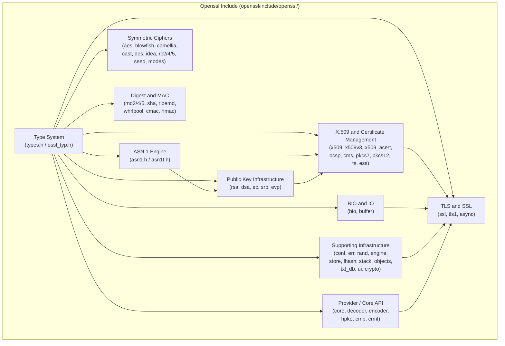

# Openssl Include

The Openssl Include module provides the complete public C header interface for OpenSSL 3.x as embedded within the MeshAgent platform. It exposes every data structure, type alias, and constant that downstream C code — including the MeshAgent core, KVM subsystems, and the Duktape scripting engine — needs to compile against OpenSSL for cryptographic operations, TLS/DTLS connectivity, certificate management, and protocol support.

This module is a **header-only interface layer**: it contains no compiled logic of its own. Instead it defines the structural contracts (structs, typedefs, enums, and macros) that link MeshAgent's C components to the OpenSSL shared library at runtime. It is the current-generation counterpart to the older [openssl-core](openssl-core/openssl-core.md) module, which targets the legacy OpenSSL 1.1.1f API surface.

---

## Architecture Overview



The **Type System** sub-module (`types.h`) is the root of the dependency graph. Every other sub-module depends on the opaque forward declarations it provides. The remaining sub-modules are largely independent of each other, with the exception that PKI depends on ASN.1, X.509 depends on both, and TLS depends on all of them.

---

## Relationship to Other Modules

The Openssl Include headers are consumed by several sibling modules in the MeshAgent tree:

| Consumer module | How it uses Openssl Include |
|---|---|
| **microstack-core** | `ILibCrypto`, `ILibWebRTC`, `ILibWebClient`, `ILibWebServer` all include OpenSSL headers for TLS, certificate verification, and DTLS |
| **microscript-duk** | Duktape bindings for `net`, `SHA256`, `EncryptionStream`, `WebRTC`, and `ScriptContainer` reference OpenSSL types |
| **meshcore-agent** | `agentcore`, `signcheck`, `wincrypto` use OpenSSL for agent authentication and binary signing |
| **meshcore-kvm-linux** | `linux_compression` uses `jpeg_compress_struct` alongside OpenSSL for screen capture pipelines |
| **openssl-core** | The legacy 1.1.1f header set — structurally identical but frozen at an older API version |

---

## Sub-Modules

The Openssl Include module is organized into nine functional sub-modules, each corresponding to a coherent group of header files.

### Type System

The foundational type system (`types.h`, formerly `ossl_typ.h`) provides all opaque forward declarations and typedef aliases used throughout the OpenSSL API. Every other sub-module depends on this one.

Key types include: `ASN1_STRING`, `ASN1_OBJECT`, `ASN1_ITEM`, `BIGNUM`, `BIO`, `EVP_CIPHER`, `EVP_MD`, `EVP_PKEY`, `RSA`, `DSA`, `EC_KEY`, `DH`, `SSL`, `SSL_CTX`, `X509`, `X509_STORE`, `OSSL_PARAM`, `OSSL_PROVIDER`, `EVP_KDF`, `EVP_MAC`, `EVP_RAND`, `EVP_SIGNATURE`, `EVP_ASYM_CIPHER`, `EVP_KEM`, `EVP_SKEY`, `EVP_SKEYMGMT`, and many more.

OpenSSL 3.x additions visible here (absent in openssl-core) include: `OSSL_LIB_CTX`, `OSSL_PROVIDER`, `OSSL_PARAM`, `OSSL_DISPATCH`, `OSSL_ALGORITHM`, `EVP_KDF`, `EVP_MAC`, `EVP_RAND`, `EVP_SIGNATURE`, `EVP_ASYM_CIPHER`, `EVP_KEM`, `EVP_SKEY`, `EVP_SKEYMGMT`, `OSSL_DECODER`, `OSSL_ENCODER`, `OSSL_SELF_TEST`, `ERR_STATE`, and `ASN1_TYPE`.

→ See [Type System](openssl-include/Type System.md)

---

### ASN.1 Engine

The ASN.1 Engine (`asn1.h`, `asn1t.h`) provides the data structures and template machinery for DER/BER encoding and decoding. It is the serialization backbone for all certificate, key, and protocol data.

Key structures: `asn1_string_st` (`ASN1_STRING`), `ASN1_ENCODING`, `ASN1_TEMPLATE`, `ASN1_TLC`, `ASN1_VALUE`, `BIT_STRING_BITNAME`, `asn1_string_table_st`, `asn1_type_st` (`ASN1_TYPE`), `ASN1_ITEM_st`, `ASN1_ADB`, `ASN1_AUX`, `ASN1_EXTERN_FUNCS`, `ASN1_PRIMITIVE_FUNCS`, `ASN1_PRINT_ARG`, `ASN1_STREAM_ARG`.

→ See [ASN.1 Engine](openssl-include/ASN.1 Engine.md)

---

### Symmetric Ciphers

The Symmetric Ciphers sub-module covers all block and stream cipher key schedule structures, plus the authenticated encryption mode contexts.

Algorithms covered: **AES** (`aes_key_st`), **Blowfish** (`bf_key_st`), **Camellia** (`camellia_key_st`), **CAST** (`cast_key_st`), **DES** (`DES_ks`), **IDEA** (`idea_key_st`), **RC2** (`rc2_key_st`), **RC4** (`rc4_key_st`), **RC5** (`rc5_key_st`), **SEED** (`seed_key_st`).

AEAD mode contexts: `GCM128_CONTEXT`, `CCM128_CONTEXT`, `OCB128_CONTEXT`, `XTS128_CONTEXT` (from `modes.h`).

EVP cipher metadata: `EVP_CIPHER_INFO` / `evp_cipher_info_st`, `EVP_CTRL_TLS1_1_MULTIBLOCK_PARAM`.

Buffer: `buf_mem_st` (`BUF_MEM`).

→ See [Symmetric Ciphers](openssl-include/Symmetric Ciphers.md)

---

### Digest and MAC

The Digest and MAC sub-module covers all hash algorithm state structures and MAC context types.

Hash algorithms: **MD2** (`MD2state_st`), **MD4** (`MD4state_st`), **MD5** (`MD5state_st`), **MDC2** (`mdc2_ctx_st`), **SHA-1** (`SHAstate_st`), **SHA-256** (`SHA256state_st`), **SHA-512** (`SHA512state_st`), **RIPEMD-160** (`RIPEMD160state_st`), **Whirlpool** (`WHIRLPOOL_CTX`).

MAC types: **CMAC** (`CMAC_CTX_st`), **HMAC** (`hmac_ctx_st`).

→ See [Digest and MAC](openssl-include/Digest and MAC.md)

---

### Public Key Infrastructure

The PKI sub-module covers asymmetric key algorithms, elliptic curve structures, and the Secure Remote Password (SRP) protocol.

RSA: `rsa_pss_params_st`, `rsa_oaep_params_st` (key parameter structures; the opaque `rsa_st` is in the Type System).

DSA: `DSA_SIG` / `DSA_SIG_st`.

Elliptic Curve: `EC_METHOD` / `ec_method_st`, `EC_GROUP` / `ec_group_st`, `EC_POINT` / `ec_point_st`, `ECPARAMETERS` / `ec_parameters_st`, `ECPKPARAMETERS` / `ecpk_parameters_st`, `ECDSA_SIG` / `ECDSA_SIG_st`, `EC_builtin_curve`.

EVP key method tables: `evp_pkey_method_st`, `evp_pkey_asn1_method_st`, `rsa_meth_st`, `dsa_method`, `dh_method`, `ec_key_method_st`.

Big-number helpers: `bn_blinding_st`, `bn_mont_ctx_st`, `bn_recp_ctx_st`, `bn_gencb_st`.

SRP: `SRP_VBASE_st`, `SRP_gN_st`, `SRP_gN_cache_st`, `SRP_user_pwd_st`.

→ See [Public Key Infrastructure](openssl-include/Public Key Infrastructure.md)

---

### X.509 and Certificate Management

The largest sub-module, covering the full X.509 certificate lifecycle, CRL management, OCSP, CMS, PKCS#7, PKCS#12, RFC 3161 Timestamping, ESS, and the new X.509 Attribute Certificate (RFC 5755) support added in OpenSSL 3.x.

Key areas:
- **Core X.509**: `x509_cinf_st`, `x509_cert_aux_st`, `X509_extension_st`, `X509_name_entry_st`, `X509_req_st`, `X509_sig_st`, `X509_val_st`, `X509_info_st`, `X509_crl_info_st`, `x509_attributes_st`, `x509_trust_st`, `private_key_st`
- **Netscape legacy**: `Netscape_spki_st`, `Netscape_spkac_st`, `Netscape_certificate_sequence`
- **PBE / KDF**: `PBEPARAM_st`, `PBE2PARAM_st`, `PBKDF2PARAM_st`, `PBMAC1PARAM`, `SCRYPT_PARAMS_st`
- **X.509v3 extensions**: `GENERAL_NAME`, `BASIC_CONSTRAINTS`, `ACCESS_DESCRIPTION`, `DIST_POINT`, `GENERAL_SUBTREE`, `POLICYINFO`, `POLICYQUALINFO`, `POLICY_CONSTRAINTS`, `POLICY_MAPPING`, `PROXY_CERT_INFO_EXTENSION`, `PROXY_POLICY`, `SXNET`, `SXNETID`, `USERNOTICE`, `NOTICEREF`, `PKEY_USAGE_PERIOD`, `OTHERNAME`, `EDIPARTYNAME`, `IPAddressFamily`, `IPAddressOrRange`, `IPAddressChoice`, `ADMISSIONS`, `ADMISSION_SYNTAX`, `PROFESSION_INFO`, `NAMING_AUTHORITY`, `ISSUER_SIGN_TOOL`
- **OpenSSL 3.x x509v3 additions**: `OSSL_AA_DIST_POINT`, `OSSL_ALLOWED_ATTRIBUTES_CHOICE`, `OSSL_ALLOWED_ATTRIBUTES_ITEM`, `OSSL_ATTRIBUTE_MAPPING`, `OSSL_ATTRIBUTE_TYPE_MAPPING`, `OSSL_ATTRIBUTE_VALUE_MAPPING`, `OSSL_BASIC_ATTR_CONSTRAINTS`, `OSSL_DAY_TIME`, `OSSL_DAY_TIME_BAND`, `OSSL_NAMED_DAY`, `OSSL_TIME_PERIOD`, `OSSL_TIME_SPEC`, `OSSL_ATAV`, `OSSL_ATTRIBUTE_DESCRIPTOR`, `SKM_DEFINE_STACK_OF_INTERNAL`
- **OCSP**: `ocsp_cert_id_st`, `ocsp_request_st`, `ocsp_basic_response_st`, `ocsp_single_response_st`, `ocsp_cert_status_st`, `ocsp_signature_st`, `ocsp_resp_bytes_st`, `ocsp_crl_id_st`, `ocsp_service_locator_st`, `ocsp_revoked_info_st`, `ocsp_one_request_st`, `ocsp_req_info_st`, `ocsp_response_data_st`
- **CMS**: `CMS_ContentInfo_st`, `CMS_SignerInfo_st`, `CMS_RecipientInfo_st`, `CMS_RecipientEncryptedKey_st`, `CMS_ReceiptRequest_st`, `CMS_Receipt_st`, `CMS_RevocationInfoChoice_st`, `CMS_OtherKeyAttribute_st`, `CMS_EnvelopedData_st`, `CMS_SignedData_st`, `CMS_CertificateChoices`
- **PKCS#7**: `pkcs7_st`, `pkcs7_signed_st`, `pkcs7_enveloped_st`, `pkcs7_signedandenveloped_st`, `pkcs7_digest_st`, `pkcs7_encrypted_st`, `pkcs7_enc_content_st`, `pkcs7_signer_info_st`, `pkcs7_recip_info_st`, `pkcs7_issuer_and_serial_st`, `PKCS7_CTX_st`
- **PKCS#12**: `PKCS12_st`, `PKCS12_SAFEBAG_st`, `PKCS12_MAC_DATA_st`, `pkcs12_bag_st`, `PKCS12_BAGS`
- **Timestamping (RFC 3161)**: `TS_req_st`, `TS_msg_imprint_st`, `TS_accuracy_st`, `TS_tst_info_st`, `TS_status_info_st`, `TS_resp_ctx`, `TS_resp_st`, `TS_verify_ctx`
- **ESS**: `ESS_cert_id`, `ESS_cert_id_v2_st`, `ESS_issuer_serial`, `ESS_signing_cert`, `ESS_signing_cert_v2_st`
- **X.509 Attribute Certificates** (OpenSSL 3.x): `X509_acert_st`, `X509_acert_info_st`, `X509_acert_issuer_v2form_st`, `ossl_issuer_serial_st`, `ossl_object_digest_info_st`, `OSSL_IETF_ATTR_SYNTAX_st`, `OSSL_IETF_ATTR_SYNTAX_VALUE_st`, `TARGET_st`, `TARGET_CERT_st`
- **X.509 Trust**: `x509_trust_st` (`X509_TRUST`)

→ See [X.509 and Certificate Management](openssl-include/X.509 and Certificate Management.md)

---

### TLS and SSL

The TLS and SSL sub-module covers the SSL/TLS connection and context structures, cipher suite descriptors, session management, and the asynchronous job infrastructure.

Key structures: `ssl_st` (`SSL`), `ssl_ctx_st` (`SSL_CTX`), `ssl_cipher_st` (`SSL_CIPHER`), `ssl_session_st` (`SSL_SESSION`), `ssl_method_st` (`SSL_METHOD`), `ssl_conf_ctx_st` (`SSL_CONF_CTX`), `tls_session_ticket_ext_st` (`TLS_SESSION_TICKET_EXT`), `tls_sigalgs_st` (`TLS_SIGALGS`), `srtp_protection_profile_st` (`SRTP_PROTECTION_PROFILE`), `evp_pkey_st` (SSL-side reference), `ssl_conn_close_info_st`, `ssl_shutdown_ex_args_st`, `ssl_stream_reset_args_st`, `timeval`.

Async infrastructure: `async_job_st` (`ASYNC_JOB`), `async_wait_ctx_st` (`ASYNC_WAIT_CTX`).

→ See [TLS and SSL](openssl-include/TLS and SSL.md)

---

### BIO and IO

The BIO and IO sub-module covers the OpenSSL abstract I/O layer, which underpins all network and file operations within the library.

Key structures: `bio_method_st` (`BIO_METHOD`), `bio_addrinfo_st` (`BIO_ADDRINFO`), `bio_dgram_sctp_sndinfo`, `bio_dgram_sctp_rcvinfo`, `bio_dgram_sctp_prinfo`, `bio_msg_st` (`BIO_MSG`), `bio_mmsg_cb_args_st` (`BIO_MMSG_CB_ARGS`), `bio_poll_descriptor_st` (`BIO_POLL_DESCRIPTOR`), `buf_mem_st` (`BUF_MEM`).

OpenSSL 3.x additions: `BIO_MSG`, `BIO_MMSG_CB_ARGS`, `BIO_POLL_DESCRIPTOR` — enabling multi-message datagram I/O and poll descriptor abstraction for QUIC support.

→ See [BIO and IO](openssl-include/BIO and IO.md)

---

### Supporting Infrastructure

The Supporting Infrastructure sub-module covers configuration parsing, error handling, random number generation, the hardware engine interface, the object store, and various utility data structures.

Key areas:
- **Configuration**: `conf_method_st`, `conf_st`, `conf_imodule_st`, `conf_module_st`, `CONF_VALUE`
- **Error handling**: `err_state_st`, `ERR_string_data_st`
- **Random**: `rand_meth_st`
- **Engine**: `ENGINE_CMD_DEFN_st`, `st_dynamic_fns`, `st_dynamic_MEM_fns`
- **Object store**: `OSSL_STORE_CTX` / `ossl_store_ctx_st`, `OSSL_STORE_LOADER` / `ossl_store_loader_st`, `OSSL_STORE_LOADER_CTX` / `ossl_store_loader_ctx_st`
- **Hash tables**: `lhash_st` (`OPENSSL_LHASH`), `lhash_node_st` (`OPENSSL_LH_NODE`)
- **Stacks**: `stack_st` (`OPENSSL_STACK`)
- **Object names**: `obj_name_st` (`OBJ_NAME`)
- **Text DB**: `txt_db_st` (`TXT_DB`)
- **UI**: `ui_string_st` (`UI_STRING`)
- **Crypto utilities**: `crypto_threadid_st` (`CRYPTO_THREADID`), `CRYPTO_dynlock`, `crypto_ex_data_st`, `tm`

→ See [Supporting Infrastructure](openssl-include/Supporting Infrastructure.md)

---

## Key Differences from openssl-core (OpenSSL 1.1.1f)

The Openssl Include module targets the OpenSSL 3.x API. The following structures and concepts are **new** relative to the legacy `openssl-core` module:

| New in OpenSSL 3.x | Description |
|---|---|
| `OSSL_LIB_CTX` | Library context for multi-tenant isolation |
| `OSSL_PROVIDER` | Pluggable cryptographic provider |
| `OSSL_PARAM` / `OSSL_PARAM_BLD` | Generic parameter passing mechanism |
| `OSSL_DISPATCH` / `OSSL_ALGORITHM` | Provider dispatch table |
| `EVP_KDF` / `EVP_KDF_CTX` | Key derivation function abstraction |
| `EVP_MAC` / `EVP_MAC_CTX` | MAC abstraction (replaces direct HMAC/CMAC) |
| `EVP_RAND` / `EVP_RAND_CTX` | DRBG abstraction |
| `EVP_SIGNATURE` | Signature algorithm abstraction |
| `EVP_ASYM_CIPHER` | Asymmetric cipher abstraction |
| `EVP_KEM` | Key encapsulation mechanism |
| `EVP_SKEY` / `EVP_SKEYMGMT` | Symmetric key management |
| `OSSL_DECODER` / `OSSL_ENCODER` | Generic key/cert encode/decode |
| `OSSL_SELF_TEST` | FIPS self-test infrastructure |
| `OSSL_HPKE_CTX` / `OSSL_HPKE_SUITE` | Hybrid Public Key Encryption (RFC 9180) |
| `OSSL_CMP_CTX` / `OSSL_CMP_PKIHEADER` | Certificate Management Protocol (RFC 4210) |
| `OSSL_CRMF_*` | Certificate Request Message Format (RFC 4211) |
| `X509_ACERT` / `X509_ACERT_INFO` | X.509 Attribute Certificates (RFC 5755) |
| `OSSL_IETF_ATTR_SYNTAX` | IETF attribute syntax for attribute certs |
| `BIO_MSG` / `BIO_POLL_DESCRIPTOR` | Multi-message datagram I/O for QUIC |
| `ssl_conn_close_info_st` | QUIC connection close information |
| `ssl_stream_reset_args_st` | QUIC stream reset arguments |
| `PKCS7_CTX_st` | Library context for PKCS#7 operations |
| `PKCS12_BAGS` | Explicit PKCS#12 bag type |
| `PBMAC1PARAM` | PBMAC1 password-based MAC parameters |
| `NETSCAPE_SPKAC` | Explicit SPKAC typedef |
| `OCSP_ONEREQ` / `OCSP_REQINFO` / `OCSP_RESPDATA` / `OCSP_REVOKEDINFO` | Explicit OCSP structure typedefs |
| `CMS_EnvelopedData` / `CMS_SignedData` | Explicit CMS content type typedefs |
| `PKCS7_RECIP_INFO` / `PKCS7_SIGNED` | Explicit PKCS#7 typedefs |
| `ESS_CERT_ID_V2` | SHA-2 based ESS cert ID |
| `conftypes.h` | Exposed `conf_method_st` / `conf_st` internals |
| `core.h` | Provider core handle and dispatch types |
| `comp.h` | `SSL_COMP` / `ssl_comp_st` compression type |
| `x509_vfy.h` | `x509_trust_st` (`X509_TRUST`) |

## Source Location

All headers reside under:

```text
openssl/include/openssl/
```

in the MeshAgent repository at [https://github.com/flamingo-stack/meshagent](https://github.com/flamingo-stack/meshagent).

## Community

Questions and discussion about MeshAgent and OpenFrame are welcome in the [OpenMSP Slack community](https://www.openmsp.ai/).
