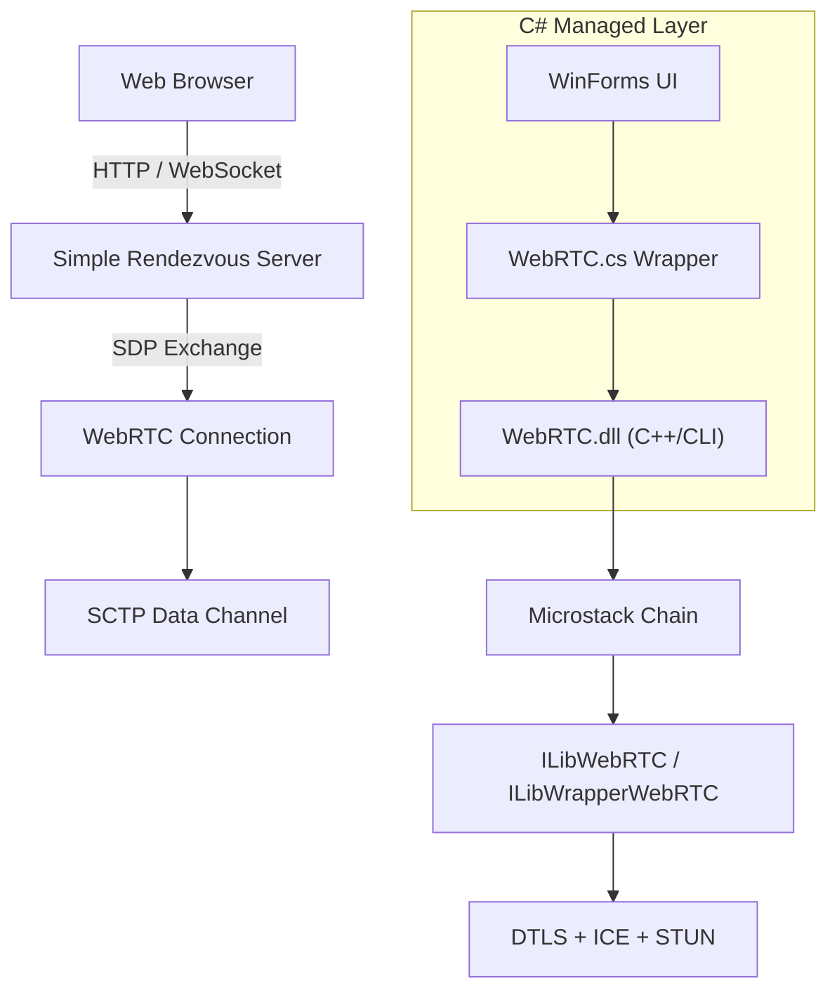
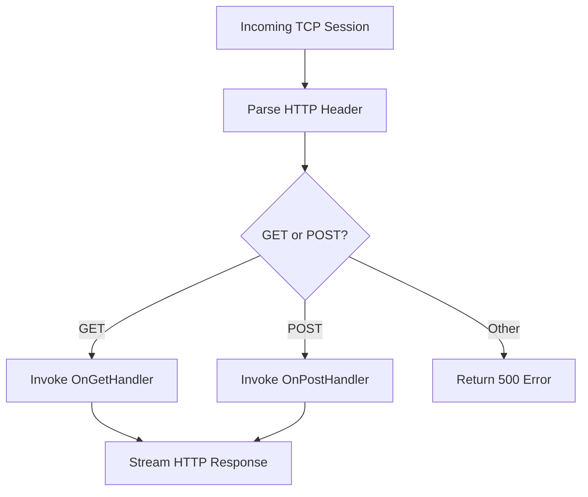
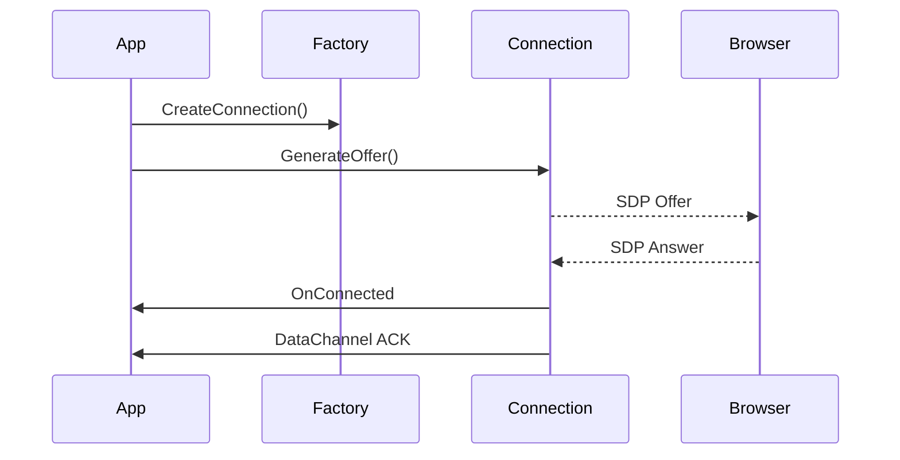
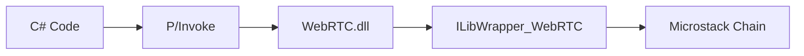
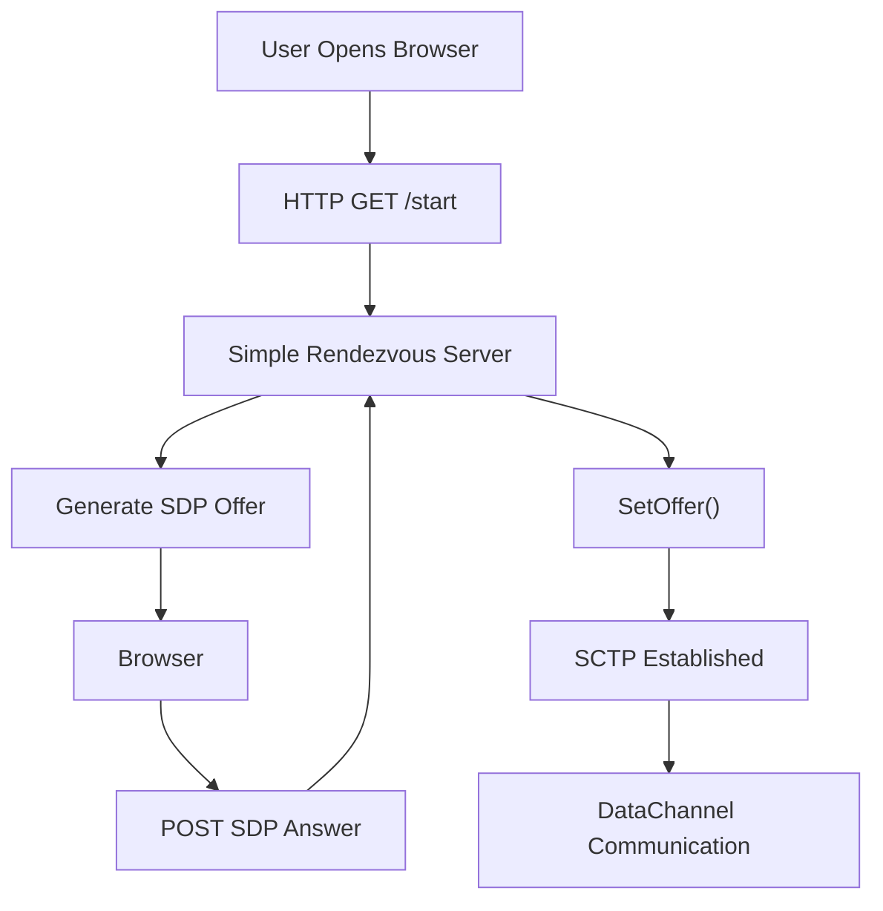

# Samples Webrtc

The **Samples Webrtc** module provides reference implementations demonstrating how to build WebRTC-enabled applications using the Microstack networking framework and its C/C# bindings. It includes:

- A **C-based rendezvous server and console sample** built on Microstack and ILibWrapper WebRTC
- A **C# Windows Forms sample application** wrapping the native WebRTC stack
- A **native C++/CLI bridge (WebRTC.dll)** exposing Microstack and WebRTC primitives to .NET

These samples illustrate signaling, STUN usage, DataChannel communication, and integration with the Microstack event chain.

---

## Architecture Overview

The module demonstrates a layered architecture:

### Key Layers

| Layer | Responsibility |
|--------|----------------|
| Browser | Generates/consumes SDP offers and answers |
| Simple Rendezvous Server | HTTP/WebSocket signaling channel |
| ILibWrapper WebRTC | Native WebRTC implementation (ICE, DTLS, SCTP) |
| WebRTC.dll | Managed bridge for .NET |
| WinForms UI | Demonstration interface and diagnostics |

---

## C Sample: Simple Rendezvous Server

**Core components:**
- `SimpleRendezvousServerStruct`
- `ILibWebServer_Session`
- `packetheader`
- `sockaddr`, `sockaddr_in6`

The C implementation builds a lightweight HTTP server using:

- `ILibWebServer`
- `ILibAsyncSocket`
- `ILibParsers`

### Responsibilities

1. Accept HTTP GET/POST requests
2. Exchange SDP offers and answers
3. Optionally upgrade to WebSocket
4. Support Digest authentication
5. Support TLS via `SSL_CTX`

### Request Handling Flow

### WebSocket Upgrade

The server supports WebSocket upgrades using:

- `SimpleRendezvousServer_UpgradeWebSocket()`
- `ILibWebServer_WebSocket_Send()`
- Fragmentation control flags

This allows exchanging SDP over WebSockets instead of raw HTTP POST.

---

## C Sample: WebRTC Microstack Console

**Core components:**
- `ILibWrapper_WebRTC_ConnectionFactory`
- `ILibWrapper_WebRTC_Connection`
- `ILibWrapper_WebRTC_DataChannel`

This sample demonstrates:

- Creating a Microstack chain
- Creating a WebRTC connection factory
- Generating offers (`GenerateOffer`)
- Setting offers (`SetOffer`)
- Handling STUN candidates
- Creating and using DataChannels

### Connection Lifecycle

### STUN Integration

If STUN is enabled:

- Candidate discovery triggers callbacks
- Updated SDP is generated via
  - `Connection_AddServerReflexiveCandidateToLocalSDP()`

This demonstrates ICE candidate handling without a full signaling server.

---

## C# Sample: WinForms Application

The C# sample builds a GUI-based WebRTC server using:

- `SimpleRendezvousServer` (managed implementation)
- `WebRTCConnection`
- `WebRTCDataChannel`
- `MicrostackChain`

### Components

| Component | Role |
|------------|------|
| MainForm | Launch and server control |
| SessionForm | Interactive WebRTC session UI |
| DebugForm | SCTP congestion diagnostics |
| StunSettingsForm | STUN configuration |
| SimpleRendezvousServer | Minimal HTTP signaling server |

---

## WebRTC.cs Wrapper

The managed wrapper provides:

- `WebRTCConnection`
- `WebRTCDataChannel`
- `MicrostackChain`
- `CustomAwaiter<T>` for async interop

### Managed ↔ Native Bridge

The wrapper handles:

- Memory allocation and marshaling
- Native callback translation
- IPEndPoint ↔ `sockaddr` conversion
- Lifetime monitoring

---

## Native Bridge: WebRTC.dll

The C++ layer exposes:

- Chain management
- XML parsing utilities
- Lifetime monitor integration
- Crypto initialization
- DTLS context setup
- WebRTC connection factory APIs

It connects the managed layer to:

- `ILibWebRTC`
- `ILibWrapperWebRTC`
- `ILibCrypto`
- `ILibAsyncSocket`

---

## Typical End-to-End Flow

---

## Key Concepts Demonstrated

- Microstack event-driven architecture
- ICE candidate gathering
- STUN-based NAT traversal
- DTLS handshake
- SCTP DataChannel reliability modes
- HTTP-based signaling
- WebSocket signaling alternative
- Managed/native interoperability

---

## Educational Value

The **Samples Webrtc** module is designed to:

- Provide a minimal but complete WebRTC reference implementation
- Show how signaling can be implemented without external services
- Demonstrate cross-platform native networking via Microstack
- Provide a reusable C# WebRTC wrapper for .NET applications

It serves as a blueprint for integrating WebRTC into larger systems built on Microstack and the MeshAgent ecosystem.
