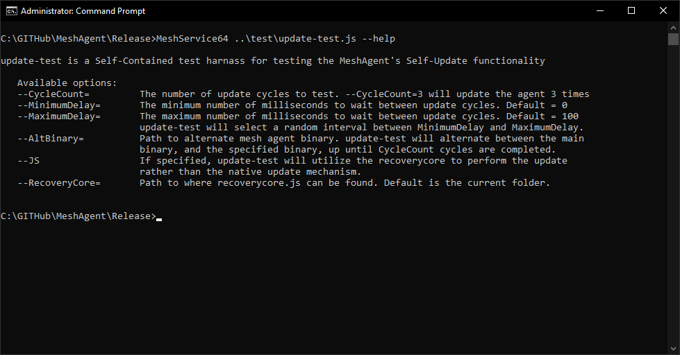
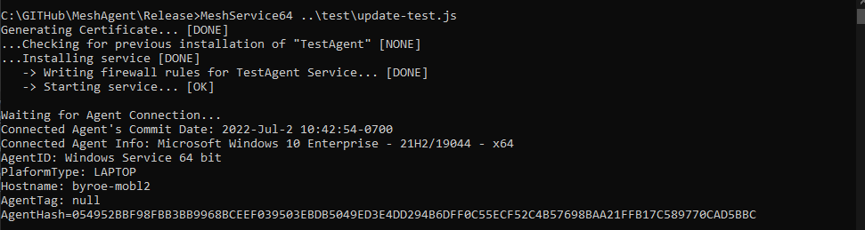
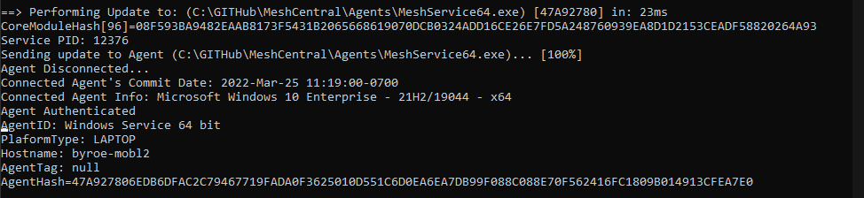
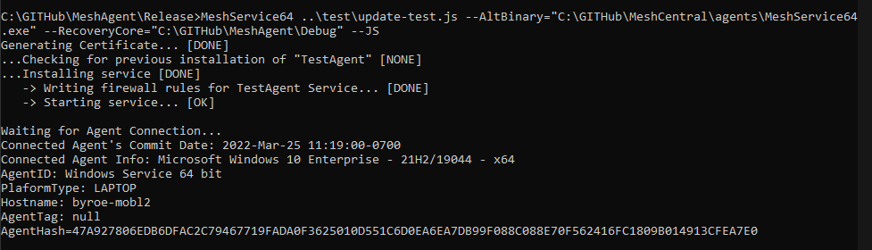

# Mesh Agent Self Update

## Abstract

This document walks thru an overview of how the Mesh Agent's Self Update mechanisms works, and how to run the test script to test the update mechanisms.

## Update Mechanisms

There are two main update mechanisms that the Mesh Agent will utilize to be able to update itself.

#### Native Update

The primary update mechanism utilized by the Mesh Agent, is the Native Update mechanism. This utilizes the Server Control Channel, as the main update mechanism.
When the agent connects to the Server and is authenticated, the server will ask the Agent for the Agent Hash. The Mesh Agent will respond by sending to the server,
the hash of the currently installed agent binary. Note, the agent and server hash the binary in such a way, that it excludes any embedded configurations. When a user installs a new agent,
and downloads the agent from the server, the server will embed the user's configuration in the binary, such that only a single file can be downloaded.

If the server determines that the hash does not match the hash of the currently deployed agent in this version of the server, the server may elect to update the agent to the latest version.
To kick off this process, the server will send a MeshAgent_AgentUpdate (13) command to the agent, via the control channel, followed by a series of MeshCommand_AgentUpdateBlock (14) commands,
which contain a fragment of the updated agent binary. The server will keep sending these blocks, while the agent will also send MeshCommand_AgentUpdateBlock (14) to confirm each block, 
as a pseudo means of flow control. Since the Server Control Channel is websocket based, these packets are ordered. After the server sends the last update block,
the server will send a final MeshCommand_AgentUpdate (13) command which will contain the SHA384 hash of the updated agent, to signal to the agent that the update has been fully sent.
The agent will be able to utilize this hash to verify that the updated agent has been correctly received.

After the agent has verified the update, it will attempt to update itself, in a platform specific way. On Non-Windows platforms this involves overwriting the agent binary
and then using the service manager, (initctl, launchctl, service, etc) to restart the service. On Windows Platforms, this involves spawning a detached cmd shell to stop the agent service, overwrite the binary,
then restart the service.

#### Recovery Core Update

As the agent has evolved, so too has the self update mechanism. Sometimes bugs have been discovered in the self update mechanism that posed problems for the self update process.
Sometimes these problems were show-stoppers that prevented the agent from being able to update, or worse, caused the agent to halt without being able to restart, etc.
Problems with the Native Self Update Mechanism, as the name suggests, would require a new agent to fix some of these problems. This poses a problem if there is a problem with the update mechanism of an already deployed agent.

To mitigate these situations, we came up with an alternative update mechanism. Recovery Core, simply refers to a stripped down Javascript core file that the server sends to the agent, 
which contains code to be able to perform a self update. This update mechanism if for all intent-and-purposes not dependent on the agent version, because most all of the implementation of the self update mechanism
is provided by the server, as JavaScript. 

This update mechanism starts with the server sending the Recovery Core to the agent, instead of the primary Mesh Core. Once the recovery core is sent, 
the server will send a JSON command on the control channel with the action set to 'agentupdate', hash set to the SHA384 hash of the update, and the url set to an https url where the agent can fetch the updated agent binary.
The recovery core JS, will download the update from the specified url, verifying the hash with the received hash value. During this process, the recovery core may send progress data via the control channel. 
Once the update has been received and verified, the agent will send a JSON command back to the server with the action field set to 'agentupdatedownloaded'. This will indicate to the server that the update has been successfully downloaded and verified.
It should be noted that the TLS certificate presented by the server hosting the agent update, must match the TLS certificate presented by the server in the Agent control channel. 

To perform the actual update after verifying receipt, the recovery core will utilise _wexecve() to stop the agent service, overwrite the agent binary, then restart the service.
On Linux and BSD platforms, the recovery core will simply overwrite the agent binary and utilize execv() to restart the agent after closing all open descriptors.

## Testing the Self Update Mechanisms

update-test.js was written to specifically test all aspects of the agent self updating mechanisms. This script will simulate a Mesh Server,
and install a Mesh Agent onto a system, configured to talk to the simulated server. The simulated server will act as an actual server will when updating the agent.
It can invoke both the native update mechanism, as well as the recovery core update mechanism. It can be configured to run the update mechanism in a cycle, 
to continually update the agent over and over again a specified number of times, to test the robustness of update mechanism.

As part of this configuration, the test supports configuraing a random timeout period such that you can specify a minimum and maximum that will elapse before the update cycle is triggered.
This is an important use case, becuase during the delay, it allows the agent to run in the background, allowing the update process to interrupt the background service to perform the update.

Another useful aspect of the test setup, is that it allows you to specify an alternate mesh agent binary. This will allow the agent to update back and forth, 
to and from the specified alternate binary and the current binary. This is useful to test updating to/from a specific agent version. For example, this would be useful to test updating from 
the stable release to the current target release.

#### Running update-test.js

Running the update-test.js test tool is simple. Simply run the Mesh Agent binary, with the location of update-test.js on the command line. If you clone the Mesh Agent Repository, 
the update-test.js script will be found in the /test folder.
You can specify --help on the command line for a brief summary of available options as well:



The most common use case of using the test tool, would be to clone the git repository for the Mesh Central Server,
and checkout the commit for whatever version of the agent that you want to test updating from. Then you can simply point update-test.js to the 'agents' folder in that repositor:


The first thing the test script will do, is validate the parameters that were passed in. If any necessary values were omitted, the script will exit, and display a brief on which parameters are missing.
The next thing the test script will do, is to install the Mesh Agent onto the system, and wait for a connection from the agent.
Once it connects, you'll see some meta-data on the connected agent, such as Commit Date, OS Name, PlatforType, etc:



When update-test.js goes to update the agent, it will display:

```bash
==> Performing Update to: (xxx) [47A92780] in 23ms
```

Where xxx is the path to the binary that the agent will update to. The hex value in the square brackets is the first couple digits of the Agent Hash, 
which can be verified after the update, as the agent will report it's Agent Hash Value.. The time displayed, is the time interval that it will delay before sending the update.
This value can be specified with the following command line switches:

```bash
--MinimumDelay
--MaximumDelay
```

If either of these values are omitted, the default values are 0-100ms, so a random interval in that range will be selected if not otherwise specified. After the update binary is sent, in a few moments, it should say:

```bash
Agent Disconnected...
```

When the agent is disconnected, the agent is performing the update. In a few moments, the agent should connect again, and you'll see the agent report it's Agent Hash:



#### Running update-test.js in Recovery Core Mode

When running update-test.js to test self updates via RecoveryCore, you'll need to specify the following two switches:

```bash
--RecoveryCore="C:\GITHub\MeshAgent\Debug"
--JS
```

In the following example, I copied recoverycore.js into the folder specified above, but it can also be found in the /agents folder of the server repository.



The flow in this mode is almost identical to Native Update Mode, except for a few subtle differences.
After the agent connects, it will push recoverycore.js to the agent. After recoverycore is pushed to the Agent, it will send a message to the server indicating which core it is running.
You should see the following displayed to verify the recoverycore is running:

```bash
Agent is running core: MeshCore Recovery
```

The update is pulled by the agent via an HTTPS GET request, so when this request is received, you should see:

```bash
Pushing Update via HTTPS... [0%]
```

The download progress will be displayed in the square brackets.
Messages that are prefixed with:

```bash
Agent:
```

are display messages that are sent from the Agent to the Server. This is normally how update status is relayed from the agent to the server. 
The following is an example exchange between the server and the agent, doing a RecoveryCore Update:


After all the update cycles are complete, update-test.js will uninstall the agent to conclude testing:

