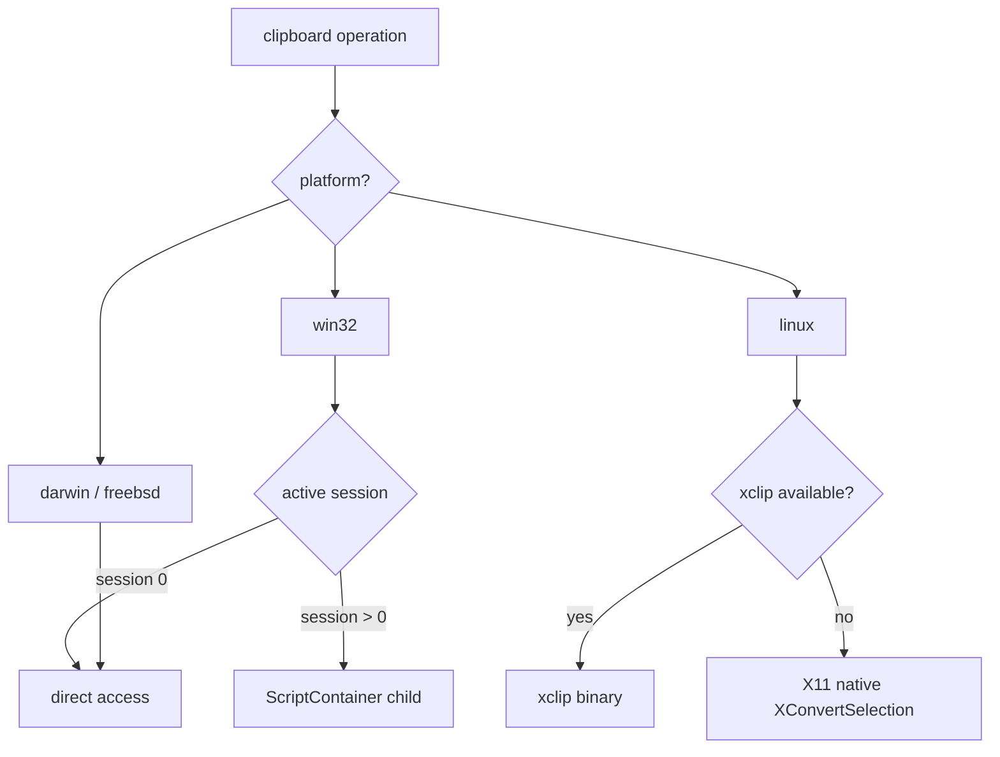

<!-- source-hash: eac46f0f522fdd126ef27b459d62dafc -->
Cross-platform clipboard read/write utility for Node.js that handles clipboard access across Windows, Linux (X11/xclip), macOS, and FreeBSD, including support for dispatching clipboard operations to specific user sessions.

## Key Components

| Export/Function | Description |
|---|---|
| `module.exports.read()` | Reads text from the clipboard, returning a Promise |
| `module.exports(data)` | Writes text to the clipboard |
| `dispatchRead(sid)` | Reads clipboard for a specific session ID; spawns a `ScriptContainer` child process when needed |
| `dispatchWrite(data, sid)` | Writes clipboard data for a specific session ID |
| `lin_readtext()` | Linux X11-native clipboard read using `XConvertSelection` and `DescriptorEvents` |
| `lin_xclip_readtext(ret)` | Linux clipboard read via `xclip` binary |
| `bsd_xclip_readtext()` | FreeBSD clipboard read via `xclip` binary |
| `nativeAddCompressedModule(name)` | Generates C code to embed a compressed JS module (build utility) |
| `nativeAddModule(name, single)` | Generates C code to embed a plain JS module (build utility) |

## Usage Example

```javascript
var clipboard = require('clipboard');

// Read from clipboard
clipboard.read().then(function(text) {
    console.log('Clipboard contents:', text);
}, function(err) {
    console.error('Read failed:', err);
});

// Write to clipboard
clipboard('Hello, world!');

// Read clipboard for a specific Windows/Linux session
clipboard.dispatchRead(sessionId).then(function(text) {
    console.log('Session clipboard:', text);
});

// Write to a specific session
clipboard.dispatchWrite('Some text', sessionId);
```

## Platform Behavior



> **Note:** On Linux, `DISPLAY` and `XAUTHORITY` environment variables are resolved via `monitor-info.getXInfo()` and injected into child processes automatically.