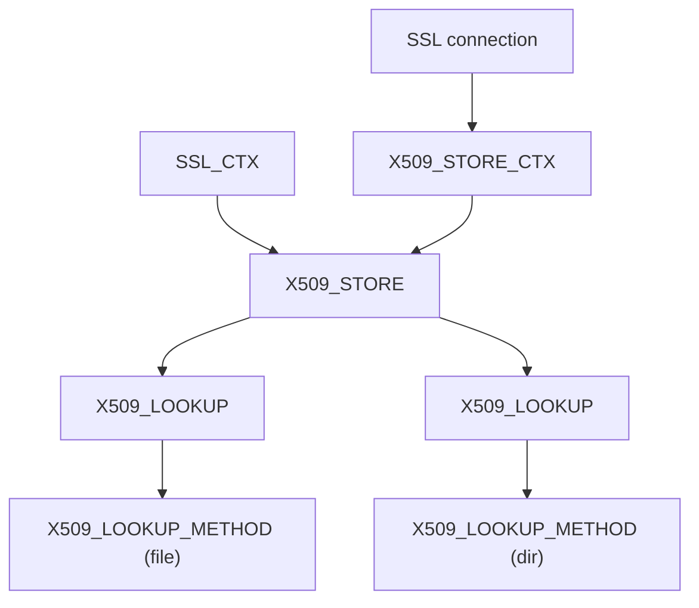

<!-- source-hash: 4b6f5a72b32435df5df4f80f506c5de2 -->
OpenSSL X.509 certificate verification header providing the core types, structures, and function declarations for building and querying certificate trust chains.

## Key Components

### Core Types & Structures

| Type | Description |
|---|---|
| `X509_STORE` | Holds certificate tables and verification state for an SSL context |
| `X509_STORE_CTX` | Per-validation context used while verifying a single certificate chain |
| `X509_LOOKUP` | Mechanism for locating certificates and CRLs within a store |
| `X509_LOOKUP_METHOD` | Backend implementation (file, directory, etc.) for a lookup |
| `X509_VERIFY_PARAM` | Verification parameters (flags, depth, hostname, policies) |
| `X509_TRUST` | Trust-checking function table entry |
| `X509_OBJECT` | Union container holding either an `X509` cert or `X509_CRL` |

### Lookup Type Enum

```c
typedef enum {
    X509_LU_NONE = 0,
    X509_LU_X509,   /* Certificate */
    X509_LU_CRL     /* Certificate Revocation List */
} X509_LOOKUP_TYPE;
```

### Stack Macros

Type-safe stack collections are defined for:
- `STACK_OF(X509_LOOKUP)` — ordered list of active lookup methods
- `STACK_OF(X509_OBJECT)` — cached certs/CRLs in a store
- `STACK_OF(X509_VERIFY_PARAM)` — parameter sets
- `STACK_OF(X509_TRUST)` — registered trust handlers

Each stack exposes a consistent API: `sk_TYPE_push`, `sk_TYPE_pop`, `sk_TYPE_find`, `sk_TYPE_free`, `sk_TYPE_dup`, etc.

## Usage Example

```c
/* Build a store, add a lookup, and verify a certificate chain */
X509_STORE *store = X509_STORE_new();
X509_LOOKUP *lookup = X509_STORE_add_lookup(store, X509_LOOKUP_file());
X509_LOOKUP_load_file(lookup, "/etc/ssl/certs/ca-bundle.crt",
                      X509_FILETYPE_PEM);

X509_STORE_CTX *ctx = X509_STORE_CTX_new();
X509_STORE_CTX_init(ctx, store, leaf_cert, chain);

int ok = X509_verify_cert(ctx);   /* 1 = valid, 0 = error */
int err = X509_STORE_CTX_get_error(ctx);

X509_STORE_CTX_free(ctx);
X509_STORE_free(store);
```

## Architecture



> **Note:** This file is auto-generated from `include/openssl/x509_vfy.h.in`. Do not edit directly. Licensed under Apache 2.0.