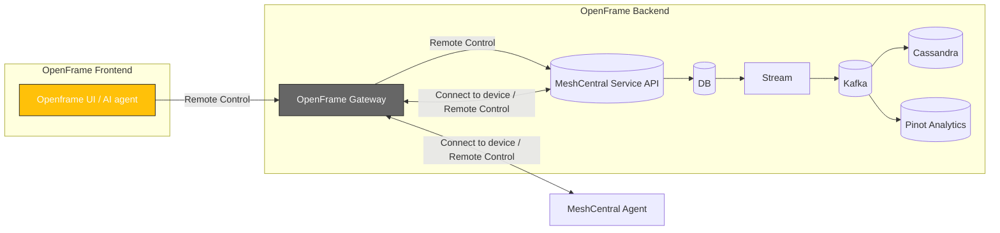

<div align="center">
  <picture>
    <!-- Dark theme -->
    <source media="(prefers-color-scheme: dark)" srcset="https://github.com/flamingo-stack/openframe-oss-tenant/blob/d82f21ba18735dac29eb0f3be5d3edf661bb0060/docs/assets/logo-openframe-full-dark-bg.png">
    <!-- Light theme -->
    <source media="(prefers-color-scheme: light)" srcset="https://github.com/flamingo-stack/openframe-oss-tenant/blob/d82f21ba18735dac29eb0f3be5d3edf661bb0060/docs/assets/logo-openframe-full-light-bg.png">
    <!-- Default / fallback -->
    
  </picture>

  <h1>MeshCentral Agent</h1>

  <p><b>Cross-platform endpoint agent for remote management, automation, and secure connectivity in the OpenFrame ecosystem.</b></p>

  <p>
    <a href="LICENSE.md">
      
    </a>
    <a href="https://www.flamingo.run/knowledge-base">
      
    </a>
    <a href="https://www.openmsp.ai/">
      
    </a>
  </p>
</div>

---

## Quick Links
- [Overview](#overview)  
- [Quick Start](#quick-start)  
- [Architecture](#architecture)
- [Security](#security)

---

## Overview

**MeshCentral** is a powerful open-source remote management and monitoring solution that provides secure, web-based access to computers and devices across networks. Originally developed by Ylian Saint-Hilaire, MeshCentral offers comprehensive remote desktop, terminal access, file management, and device control capabilities.

### Key Capabilities
- **Remote Desktop & Terminal:** Full graphical desktop control and command-line access
- **File Management:** Upload, download, and manage files on remote devices
- **Hardware Monitoring:** Track CPU, memory, disk usage, and system health
- **Multi-Platform Support:** Windows, macOS, Linux, and more
- **Secure Communication:** End-to-end encryption with TLS 1.3
- **Web-Based Interface:** No client software required - manage from any browser
- **Intel AMT Support:** Hardware-level management for compatible devices

### Integration with OpenFrame

In OpenFrame, the MeshCentral agent is seamlessly integrated to provide:
- Unified device management through OpenFrame UI
- Automated agent deployment and configuration
- Centralized authentication via JWT tokens
- Real-time monitoring and alerting through Kafka and Pinot
- Plugin-based extensibility for custom automation

### Official Documentation
- **GitHub Repository:** [github.com/Ylianst/MeshCentral](https://github.com/Ylianst/MeshCentral)

---

## Highlights

- Remote management of endpoints (Windows, macOS, Linux)  
- Integrated installation through OpenFrame UI - no manual setup required
- Secure integration with OpenFrame Gateway  
- JWT-based authentication and enrollment secrets  
- Sandbox model for plugins and scripts  
- Auto-update support with signed binaries  
- Extensible for automation and monitoring  

---

## Architecture

MeshAgent runs on endpoints and connects securely to OpenFrame Gateway:



## Quick Start

### Prerequisites

**No manual installation required!** The MeshCentral agent is automatically installed and configured when you deploy it through the OpenFrame UI.

Requirements:
- OpenFrame instance running with MeshCentral service enabled
- Access to OpenFrame UI
- Supported operating system on target endpoints:
  - **Linux:** Ubuntu, Debian, CentOS, RHEL, Fedora
  - **macOS:** 10.14+ (Mojave and later)
  - **Windows:** Windows 7, Windows 10, Windows 11, Windows Server 2016+

### Installation

1. **Log in to OpenFrame UI**

2. **Navigate to the Devices tab**
   - Click on **"Devices"** in the left sidebar
   - Click **"Add Device"** or **"Enroll New Device"** button

3. **Get the installation link**
   - OpenFrame will generate a unique enrollment link/script for your device
   - This link contains:
     - MeshCentral agent installer
     - Pre-configured connection settings (Gateway URL, enrollment token)
     - Auto-configuration for OpenFrame integration

4. **Install the agent on your endpoint**
   
   **For Linux/macOS:**
   ```bash
   curl -L https://your-openframe-instance/api/devices/enroll/<enrollment-token> | sudo bash
   ```
   
   **For Windows (PowerShell as Administrator):**
   ```powershell
   Invoke-WebRequest -Uri "https://your-openframe-instance/api/devices/enroll/<enrollment-token>" -UseBasicParsing | Invoke-Expression
   ```

5. **Verify installation**
   - The device should appear in the OpenFrame Devices list within 1-2 minutes
   - Status will change from "Pending" to "Online" once connected
   - You can now manage the device remotely through OpenFrame UI

### What Gets Installed

The installation script automatically:
- Downloads the appropriate MeshCentral agent for your OS
- Configures the agent to connect to your OpenFrame Gateway
- Sets up JWT-based authentication
- Registers the device in OpenFrame
- Starts the agent service
- Enables auto-update functionality

---

## Security

- TLS 1.2 enforced for all transport
- JWT authentication via OpenFrame Gateway
- Enrollment secrets or pre-shared keys supported
- Sandbox model for plugins and scripts
- Auto-update support with signed binaries

Found a vulnerability? Email security@flamingo.run instead of opening a public issue.

---

## License

This project is licensed under the **Flamingo Unified License v1.0** ([LICENSE.md](LICENSE.md)).

---

<div align="center">
  <table border="0" cellspacing="0" cellpadding="0">
    <tr>
      <td align="center">
        Built with 💛 by the <a href="https://www.flamingo.run/about"><b>Flamingo</b></a> team
      </td>
      <td align="center">
        <a href="https://www.flamingo.run">Website</a> • 
        <a href="https://www.flamingo.run/knowledge-base">Knowledge Base</a> • 
        <a href="https://www.linkedin.com/showcase/openframemsp/about/">LinkedIn</a> • 
        <a href="https://www.openmsp.ai/">Community</a>
      </td>
    </tr>
  </table>
</div>
